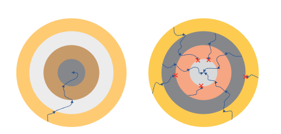
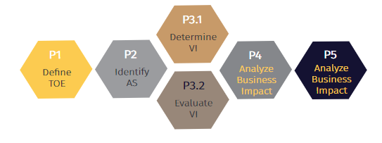
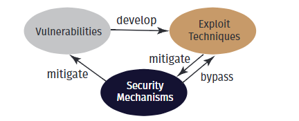
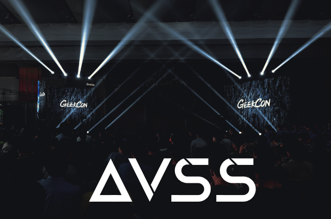

# AVSS白皮书1.0

## 前言

网络安全的本质在于攻防的持续较量，漏洞是一切威胁的基础。然而，漏洞永远无法完全消除，这是安全界的共识。

假设存在3个在线支付系统、5个品牌智能手机、7个智能汽车品牌和10个办公网络，一个有经验有耐心的攻击者仍然不可避免地会发现新的漏洞，从而使这些系统容易受到破坏。

那么，我们在安全上的努力的价值在哪里？

安全不是绝对的，不简简单单是非黑即白的。如果仅仅从安全和不安全两个角度去思考网络安全，会简化安全的复杂性，不利于企业对安全的投资。

安全防御的首要目标是提高攻击者的成本，使他们对系统的攻击变得尽可能困难。

多年来，**深蓝（DARKNAVY）**和**GEEKCON**深入研究恶意攻击者的思维方式，帮助众多企业识别漏洞。我们认识到一个严酷的现实：渗透一个复杂坚固的系统往往需要顶级安全研究团队花费数百天时间，而在安全方面投资较少的系统可能会在几天内遭到普通攻击者的攻击。通过攻击者视角，深蓝理解强大安全措施的重要性和价值。作为消费者，我们倾向于选择那些对潜在攻击者造成更高成本的产品或系统，即更加安全的产品。事实上，对于优先考虑安全投资的企业来说，安全是一种核心竞争力，而不是一种成本负担。

我们敦促各行各业将安全视为重要的市场优势。只有这样，网络安全才会成为各个行业的优先事项，有效保护用户的安全。

考虑一下传统的汽车行业，人身安全是其首要考虑的优势。正如碰撞测试决定哪辆车能够更好地保护乘客一样，防止在线跟踪的能力也决定了车辆的安全能力。要成为核心竞争优势，安全对于消费者和企业领导者来说必须是有形的、可量化的。

因此，我们开发并推广**AVSS**（Adversarial Vulnerability Scoring System, 对抗性漏洞评分系统）—— 一种新颖、开放、基于攻击者视角的安全评估框架。 AVSS 不仅强化防御，而且支持数据驱动的决策。通过量化安全优势，AVSS 使企业能够做出明智的决策，最大限度地提高安全投资的收益并走在新兴威胁的前面。

我们的愿景是通过安全生态系统内的共同努力打造一个强大的网络安全评估方法，其中AVSS充当灯塔，帮助企业在面对不断变化的网络安全风险时提抗风险能力。

> 基于攻击者视角的对抗，是证明安全防御机制水平和有效性的唯一科学衡量标准。
>
> 

> Daniel Wang
> 深蓝创始人
> 

## 1 什么是AVSS

> AVSS优势
>
> - 改变对于安全的理解
> - 优化资源
> - 数据驱动的决策

AVSS（Adversarial Vulnerability Scoring System, 对抗性漏洞评分系统）是一种基于漏洞利用和防御，从攻击者的角度，系统地衡量评估对象的安全防御能力的量化方法。

AVSS 是一种评分指南，用于根据现实世界的对抗活动评估信息系统、IoT（Internet of Things，物联网）或其子组件的安全级别。它首先由独立安全研究组织深蓝提出、维护和管理。

AVSS从攻防对抗的角度构建了系统化的量化评估框架，满足信息技术不断发展对安全性能评估的更新要求。通过将信息系统、物联网设备或其各自子组件的安全评估分数与其他同行或自身的先前版本进行比较，帮助IoT设备的信息系统运营和研发团队准确了解当前系统的安全状况，更好地衡量信息学安全资源的回报，包括人员、资金和设备等，从而系统地评估安全投资的直接收益及其对业务的贡献。

AVSS已在金融支付、移动计算、智能制造、车联网等多个领域得到实践。这些项目为组织的信息系统和产品提供了安全防御措施，并成为其业务决策的重要依据。

AVSS被设计为一种开放的方法论，通过社区人才、学术机构、研究组织、制造商共同参与，不断改进，从而推动安全生态系统的发展。

## 2 AVSS亮点

### 2.1 从真实对抗的角度评估安全性

目前的安全评估框架大多侧重于防御方面，强调安全防御机制的完整性和合规性。这些框架缺乏从攻击者角度进行对抗性评估。AVSS的出现为业界提供了新的视角来检查和帮助增强信息系统、IoT或其子组件的安全性。

信息技术的快速发展导致安全评估的需求不断变化。基于真实攻击者视角的安全系统的出现已成为必然趋势。安全评估已经从验证基本安全功能发展到确认网络安全保障的功能有效性，再到验证全面的安全机制和纵深防御体系。然而，即使拥有完善的防御机制，随着安全漏洞的不断出现，攻击者仍然可以成功攻击目标，从而暴露出系统或产品的安全问题。

> 漏洞永远无法完全消除。防御就是增加攻击成本。

因此，从攻击者的角度进行评估就变得很重要。渗透测试、漏洞挖掘、漏洞评估已转变为一种新的网络安全评估方法，即CVSS，根据系统或产品中发现的漏洞数量来反映目标对象的网络安全水平。

| 周期                                           | 特征                                         | 评估标准                                                     |
| ---------------------------------------------- | -------------------------------------------- | ------------------------------------------------------------ |
| 操作系统和网络的早期阶段                       | 需要保密，防止信息泄露                       | 机密性、完整性和可用性                                       |
| 互联网和PC时代                                 | 病毒、蠕虫猖獗；系统充满漏洞                 | 杀毒软件能力评估                                             |
| 后PC和移动互联网时代                           | 防御机制的有效性开始显现，利用漏洞渗透系统   | 根据漏洞数量，通用漏洞评分系统（CVSS）以漏洞评估为核心，反映系统安全水平 |
| 各种安全解决方案层出不穷，优秀的安全从业者出现 | 防御机制日趋成熟，绕过这些机制成为攻击的核心 | AVSS评估通过评估防御机制的有效性，量化系统安全能力，指导实体进行安全投资 |

> 为什么 AVSS 采取不同的方法
>
> - 关注攻击成本
> - 不仅仅统计漏洞数量 
> - 进行渗透测试

复杂信息系统和IoT中安全防御机制的快速发展进一步增加了攻击的复杂性。攻击者往往需要同时利用多个漏洞，形成攻击链，逐步渗透他们的目标。在这种情况下，单个漏洞可能不足以实现攻击目标。然而，当多个漏洞相互关联形成完整的攻击链时，就会对系统造成严重威胁。

因此，对于信息系统、IoT或其子组件的安全评估，有必要从评估安全机制和脆弱性转向全面的现实世界对抗性评估。模拟真实攻击场景进行深入测试和漏洞挖掘时，评估过程应当更注重业务流程与实际应用场景的结合。确保信息系统和IoT在真实环境中面临恶意攻击时能够有效抵御、检测攻击并快速恢复正常。这样的评估系统可以帮助组织更好地理解和管理信息安全风险，从而构建更具弹性和适应性的安全保障措施。

> 不识进攻，怎能抵挡攻击？

AVSS认为

- 漏洞永远无法完全消除，所有安全防御工作的目标都是尽可能提高攻击成本
- 仅仅根据漏洞数量、是否被破坏来评估系统的安全级别，甚至使用CVSS，缺乏科学合理性
- **基于攻击者视角的对抗，是证明安全防御机制水平和有效性的唯一科学衡量标准**

### 2.2 不仅验证漏洞，而且也验证安全防御机制的有效性

在现实世界的系统和设备中，安全漏洞和防御机制并存。随着现代安全体系的不断完善，特别是安全防御机制的逐步建立，漏洞被攻击者利用的难度越来越大。但漏洞的存在和发现具有随机性和不确定性，无法完全控制。安全防御机制有效性的验证一直是安全评估的挑战。AVSS不仅关注真实的安全对抗测试，还提出了验证防御机制有效性的想法。实战是评估安全防御机制有效性的唯一合乎逻辑的方法。因此，需要进行实际的漏洞利用来测试安全防御机制的有效性。AVSS通过挖掘评估目标的漏洞并进行漏洞利用，可以对评估目标的安全防御机制进行深度测试，并提供安全防御机制有效性的量化指标。

> AVSS的优势：
>
> - 绕过外围防御
> - 探索更深层次的弱点
> - 更加全面的评估

更重要的是，通过在评估之前将漏洞置于目标中，AVSS可以突破常规模式，绕过特定的防御机制，探索和验证更深层次的漏洞，从而保证测试系统的安全性和稳定性。通常，系统外层的保护是最严格的，具有最全面的安全防御机制。如果从其他攻击者的角度进行测试无法绕过外层防护机制，就无法评估系统内部的安全级别（如上图所示）。这使得评估不够全面、缺乏深度，仅验证外围防御能力。但通过AVSS提供的防御机制验证，在测试客户端的配合下，可以开放测试系统更多的资源进行评估，允许从多个攻击入口、不同的攻击级别进行测试，从而全面验证安全防御机制的有效性。

因此，AVSS提供的评估结果可以描绘出系统安全的全景图，为系统安全提供更全面、更深入的评估结果。

### 2.3 开放框架支持参与者协同改进

AVSS作为一个开放的框架，积极倡导业界协作和广泛参与，特别欢迎各厂商共同推动其发展和完善。信息安全涉及的领域非常广泛。不同行业在应用场景中面临着不同的安全挑战。此外，不同IoT技术的特点也各不相同，使得信息安全评估成为一项复杂多样的任务。我们需要一种评估方法，不仅具有很强的可扩展性，而且能够灵活适应不同领域和场景的具体要求。

为满足信息安全多样性对评估框架的要求，AVSS积极推动和鼓励监管部门、行业和地方实体、研究机构、社区力量、IoT制造商等多方参与。在AVSS开放框架下，各参与方遵循统一的方法论，结合不同地区和行业的监管要求、系统产品技术特点、安全标准等，制定具有地域特色、行业特点、独特应用场景的评价标准和框架。通过这种开放协作的方式，不同地区、行业、技术领域的AVSS应用和框架将不断丰富和完善。

> AVSS如何实现开放协作：
>
> - 多元化的参与者
> - 统一的方法论
> - 可定制的框架

随着多方参与、共同开发，AVSS将逐步演变成更加全面、高效的安全评估方案。不仅支撑信息安全产业发展，还将推动产业和行业生态圈的进步。

## 3 AVSS价值

> AVSS 考虑：
>
> - 漏洞的存在
> - 漏洞的利用
> - 防御机制的有效性

AVSS的核心价值在于能够准确衡量系统的安全性。

随着万物互联的时代到来，各种类型的系统和设备共存，每种系统和设备都有不同水平的技术和安全投资。系统中的这些差异导致它们防御漏洞攻击的能力各不相同。同一漏洞的影响在不同系统中可能存在很大差异，这不仅取决于特定的系统环境，还取决于攻击者的策略。因此，以漏洞的数量和严重程度作为评估安全性的指标是不准确的。仅仅因为漏洞仅存在于较新版本的软件中，并不一定意味着新版本的安全性不如旧版本。虽然较新版本的软件可能存在特定的漏洞，但它们也可能采用新的安全机制或架构，从而显着增强其抵御漏洞利用的能力。在这种情况下，需要一种针对真实安全状况的更准确、更具反思性的评估方法。

### 3.1 让安全成为产品的核心竞争力

AVSS对漏洞、漏洞的可利用性、防御机制的有效性等多个维度进行评估，是安全防御能力的体现，也代表了实施攻击的成本。

随着消费者对信息安全越来越重视，选择安全性更好的产品将成为更多用户的共识。 AVSS提供的量化评估不仅增强了IoT厂商信息安全工作的透明度，也让产品的安全能力成为产品的特性。

数字时代，信息安全无疑成为IoT产品质量和安全的关键因素。一款优秀的产品或一款值得信赖的IoT设备，不仅要在功能和用户体验上出色，还要建立健全的信息安全防护系统。该系统保证数据的安全存储和传输，有效防止信息泄露、篡改或丢失，保障系统和数据的安全。 AVSS从漏洞利用、防御机制有效性等多个方面进行评估，以量化值呈现评估结果，直观了解评估对象的安全级别。

> AVSS 使制造商受益： 
>
> - 安全基准测试
> - 数据驱动决策
> - 安全作为差异化因素

AVSS对评估对象的各项信息安全指标进行评估，使用户能够直观地了解产品的信息安全能力。通过客观评估和同行比较，产品安全不再只是一个抽象概念，而是任何IoT产品的核心价值属性。

对于设备制造商来说，AVSS评估结果可以作为产品合规性的参考，将信息安全纳入产品质量的评估要素。通过将产品安全性与同行或同一系统的旧版本进行比较，量化评估可以反映产品信息安全设计的投入产出有效性，促使制造商在产品设计过程中更加关注其产品的信息安全特性。

对于用户来说，AVSS定量评估结果直观易懂，提高用户对于产品的信心，鼓励他们选择更加安全的产品。

### 3.2 让安全成为业务保障的关键支撑

信息系统是组织业务运营的核心支撑，承载着各种关键数据和业务流程。信息安全系统的稳定、安全运行为业务安全提供了基础保障。 AVSS通过精准的量化评分方式，让安全投资可视化、可衡量，成为业务保障的有力支撑。

首先，AVSS的评分系统为组织提供了一个明确的信息安全级别指标。基于AVSS评估，组织可以很好地了解其信息系统的安全防御机制在多个维度上的表现，从而能够在安全性方面进行有针对性的投资和改进。这有助于更好地决策哪些方面需要改进以及如何分配信息安全管理资源，避免安全团队和业务团队之间信息安全意识差异带来的决策挑战。组织可以利用AVSS评估结果来制定和调整信息安全策略，确保信息系统能够稳定、安全地支撑业务运营。

此外，AVSS定量评估使安全投资变得可衡量。通常情况下，信息安全投资往往难以量化，但AVSS为组织提供了量化且可对比的评估系统。通过信息系统AVSS评估结果的横向和纵向比较，组织可以更清晰地了解信息安全投资的有效性和投资回报（上图所示：AVSS评估根据组织现有体系与行业领先实践的差距，为组织安全投资方向和规模决策提供明确支持）。

## 4 AVSS方法论

### 4.1 评估框架

AVSS从攻防对抗的角度来衡量和评估目标对象的安全防御的有效性以及级别。以真实场景中的技术对抗取代主观评价。 AVSS基于丰富的漏洞、利用方法和安全攻击技术，对评估对象进行全面、系统、深入的对抗性评估，真实反映评估对象的安全防御能力。

### 4.2 基本概念

以下是AVSS中经常使用的关键术语

**评估目标（Target of Evaluation, TOE）**

AVSS中的评估目标可以是信息系统、IoT或其功能组件，例如企业内网系统、智能手机、车联网、网站、认证模块等。这些都可以是评估目标，即TOE，都是TOE中单独的一个类别（TOE类）都有相似的攻击面和安全要求。TOE类的建立旨在更好地识别、评估和比较评估对象，因此这些类不是静态的，可以通过AVSS根据对象的演化性质进行调整。

**攻击面（Attack Surface，AS）**

AS是指TOE内可能受到攻击的任何服务、功能或防御措施和机制。与传统攻防测试中的外部攻击面不同，AVSS中的AS可以根据评估目的进行更深入、更精细的分解。例如，要验证系统级别的防御机制，可以直接暴露该防御机制的接口，形成待验证的攻击面，而不是自外向内逐层攻击。

**防御和攻击框架（Defense & Attack Framework，DAF）**

DAF是深蓝针对TOE的各种安全漏洞、利用方法、攻击技术手段、防御机制形成的知识库，为开展AVSS安全评估提供重要的技术支撑。 **深蓝维护并发布了一个开放的DAF**，但是实施AVSS的组织也可以根据自己的需求、产品/系统特性、行业特征和技术研究构建自己的DAF。

**验证项（Verification Items，VI）**

VI是指可能影响AS的安全漏洞和利用方法。这些项目将由评估人员在进行AVSS评估过程中基于DAF库进行整理，或者在验证AS过程中新发现。

**评估矩阵（Evaluation Matrix，EM）**

一个AS可以受多个VI影响，一个VI可以应用于多个AS。列举AS和VI后，就形成了综合的EM。 EM作为评估者实施技术攻防验证、评估TOE防御有效性的基础。

**定量评价（EQuantitative Evaluation，QE）**

在基于EM评估矩阵对TOE目标进行技术验证时，评估人员根据各种评估指标进行量化评估，得出TOE评估目标安全水平、潜在的安全漏洞和改进建议。

### 4.3 评估指标

> AVSS计算攻击面分数时考虑：
>
> - 漏洞严重性
> - 攻击面特征
> - 攻击链位置
> - 系统使用情况
> - 商业逻辑
> - 数据敏感性

一旦AVSS为不同的TOE评估对象识别出相应的AS攻击面和VI漏洞，它们就会被组合成一个EM评估矩阵，其中包括一系列潜在的攻击点和攻击路径。 AVSS根据**漏洞利用**和**影响后果**两组指标来评估不同的攻击面。

- **漏洞利用**反映了对TOE实施验证项攻击时利用缺陷的难度程度，从而反映了TOE的防御能力。
- **影响后果**评估了对AS攻击面实施验证攻击后可能造成的所有潜在危害。这些结果是根据不同的实际影响进行评分。

**漏洞利用**：该指标反映了TOE的攻击面中存在的技术缺陷以及利用这些缺陷的可能性和成本。根据人员能力、目标信息、攻击时间、攻击资源等因素综合评估。每个指标分为多个级别，例如利用缺陷所需的能力，从没有计算机技能到高度专业化的知识，并提供相应的分数。人员能力要求越高，得分越高，安全保障精准衡量。

**影响后果**：针对AS攻击面进行验证攻击时，防御机制保护的TOE可能会受到影响，需要从数据机密性、完整性、可用性等多个维度进行评估。评估结果还根据不同的实际影响提供相应的分数。

**攻击面评估**：TOE的攻击面构成了AVSS处理的基础。一旦对每个攻击面实施VI验证项，就会为该攻击面创建一个评估分数，综合利用缺陷和影响后果的因素，以准确反映TOE防御机制的有效性。

- 不同的VI漏洞验证项可能有不同的评分值，参考漏洞利用的评价指标。
- 同一VI验证项应用于不同的攻击面时，其得分可能会有所不同，具体取决于攻击面的特征及其防御机制。
- VI验证项评分不仅考虑单个攻击面，还考虑它们在攻击链中的位置。例如，从A攻击的结果中只能获得一般信息，而某个漏洞利用B需要特定的信息，这些信息恰好是由利用A提供的，那么该A验证项的得分将不限于其自身防御能力。

**商业价值分析**：AVSS评估方法基于攻防分析，对TOE的安全级别和防御有效性进行全面的量化评估。然而，单纯的技术评估可能无法全面、准确地反映TOE的安全风险。同一TOE在不同的应用场景、业务逻辑、关联信息和数据下，潜在的影响和后果可能存在显着差异，需要进行商业价值分析。该分析结合不同应用场景下攻击面的评估结果及其潜在影响和后果，形成针对特定场景和业务属性的评估结论。

**P1：定义TOE**

由于信息系统、IoT或其子组件的复杂性，在进行攻防分析之前需要对TOE有一个初步的了解，并确定TOE所属的类别。

AVS 已为特定类别的TOE识别了基本攻击面组合。因此，一旦TOE被识别和分类，就为下一步的工作打下了良好的基础。

如果无法在任何当前已建立的类别中识别TOE，则在此过程中需要创建一个新的TOE类别。一旦完成下一流程的工作，就会形成这个新的TOE类别的基本攻击面组合。

**P2：识别AS**

此过程建立在前一阶段工作的基础上，最终形成用于评估的攻击面组合。

如果对TOE进行了识别和分类，则此过程中的工作包括评估TOE的攻击面与相应类别的基本攻击面组合之间的匹配性。删除不适用的攻击面，并将确定的TOE任何攻击面添加到最终的攻击面组合列表中。

如果TOE不属于任何已建立的类别，则此过程的工作包括研究TOE，识别所有攻击面，并分析这些攻击面，为新创建的TOE类别构建基本攻击面组合列表。

**P3：确定VI**

在此过程中，基于DAF针对不同的攻击面形成VI验证项，从而创建EM评估矩阵。基于评估矩阵，对目标攻击面进行对抗性安全验证和技术分析，分析结果作为安全评分的主要依据。

**P4：分析商业影响**

在此过程中，结合TOE的业务应用场景和相关业务需求，对评估实施阶段的技术对抗分析结果进行分析。将技术分析的过程和结果映射到具体的业务场景，重新分析和评估潜在的业务风险。

此外，在此过程中，还对信息系统、IoT或其子组件的资源投入、业务支撑能力、网络安全投资回报等进行业务分析和评估，表明TOE安全对业务的综合影响。

**P5：生成AVSS定量评价报告**

该阶段定量呈现技术分析和价值分析的过程和结果。包括量化TOE的整体安全结果，并在必要时单独量化特定业务场景或技术组件的统计数据。评估流程、技术对抗结果、价值分析和量化呈现构成了TOE的AVSS评估报告，以及相应的安全改进建议。

## 5 AVSS实施

### 5.1 DAF（防御和攻击框架）

DAF（防御和攻击框架）作为AVSS评估的技术支柱，包含AVSS评估所需的技术要素。 DAF包括漏洞库、利用技术库、防御机制库。

#### 5.1.1 DAF漏洞库

DAF漏洞库包含代表性漏洞集合，表示TOE中可能出现的潜在漏洞。该库包含来自各种场景的漏洞集合，作为对不同类型系统进行AVSS评估的指标。

DAF漏洞库对目标系统表现出很强的特异性，不同目标系统的漏洞集存在显着差异。例如，智能手机中的操作系统内核和浏览器框架相关的漏洞构成不同的漏洞集合，IoT中的漏洞集合与信息系统中的漏洞集合也有很大不同。

以内存破坏漏洞为例，内存破坏型漏洞的防御能力是系统安全能力的重要组成部分。根据MSRC在CppCon 2019 上发布的数据，2006年至2018年的CVE数量中约有70%是内存损坏漏洞，包括堆栈溢出、UAF等常见漏洞。

以操作系统核心为评估目标时，深蓝现有的DAF漏洞库包含多种类型的漏洞，涵盖了真实系统核心中常见的各种漏洞类型，如栈溢出、堆溢出、UAF和条件竞争。这些漏洞根据其破坏性影响进行量化。然后利用系统核心的DAF漏洞库对核心防御机制进行AVSS评估，反映不同系统核心针对DAF漏洞库的防御能力。

相比之下，浏览器中，DAF漏洞库涵盖了其他各种常见漏洞，包括JS引擎（例如V8或SpiderMonkey）中的类型混淆和越界读写；渲染引擎（例如，blink和DOM）中的堆溢出和UAF，以及浏览器进程本身的UAF漏洞。

#### 5.1.2 DAF漏洞利用技术库

DAF漏洞利用技术库不仅仅局限于攻击面，它提供了各种有针对性的技术，包括攻击者可能用来利用各种安全场景中的漏洞。这些技术是针对特定目标系统量身定制的，反映了现实世界的攻击方法。

例如，在评估浏览器时，该库可能包含：

- 绕过沙箱（浏览器引擎的一种安全机制）。
- 利用分配器获取任意堆分配原语，使攻击者能够控制内存分配。
- 通过跨线程分配的漏洞利用，在浏览器的不同部分之间泄露数据。

这种有针对性的方法确保AVSS评估更加现实和有效。

#### 5.1.3 DAF防御机制库

DAF防御机制库作为安全措施的综合目录，可以对抗利用漏洞利用技术库中识别的攻击技术。它根据针对不同类型漏洞和安全场景的有效性，对各种防御机制进行分类。

DAF防御机制库对AVSS评估至关重要，因为它允许：

- 识别合适的防御：评估人员可以评估哪些防御机制对于目标系统中识别的特定漏洞最有效。
- 了解漏洞缓解能力：每种防御机制都是根据其缓解不同类型漏洞的能力进行评估的。这有助于评估目标系统的整体安全状况。

我们以操作系统中的内存破坏漏洞为例。 DAF防御机制库包括栈Cookie、地址空间布局随机化（ASLR）、数据执行保护（DEP）、指针验证码（PAC）、控制流完整性（CFI）和内存标记扩展（MTE）等。这些防御措施的有效性取决于内存破坏漏洞的具体类型。然而，通过良好的实践，它们的组合显着增强了操作系统的整体安全。

### 5.2 AVSS实施的最佳实践

纵深防御的理念早已广泛应用于现代信息安全设计中，系统内部部署了不同层次、不同类型的安全防御机制。 AVSS评估的核心思想是通过评估安全漏洞的可利用性来表征防御机制的有效性，从而准确评估系统的整体安全。

通过足够的设置，AVSS评估需要将DAF漏洞库中的某些漏洞集合放置在目标系统或设备的攻击面内。然后技术人员以相关的DAF漏洞利用技术库为VI验证项进行对抗性评估，评估不同质量和不同类型的漏洞可利用性。通过定量分析目标系统中安全漏洞带来的安全威胁以及各防御机制针对漏洞的防御能力，评估目标系统的整体安全能力水平。

AVSS DAF包括针对不同攻击面的评估漏洞集合。通过对各层攻击面所包含的防御机制的安全能力进行对抗性评估，可以对纵深防御进行综合评估。

### 5.3 AVSS敏捷实践

> 在没有预先设置漏洞的情况下评估安全性

如果技术环境不支持在TOE及其各个级别中预先放置安全漏洞，对抗性评估的切入点将受到限制，并且可能无法完成最佳操作实践。然而，这并不意味着系统不能被评估。 AVSS为此类场景提供了敏捷实践。

敏捷实践包括分析和识别TOE的攻击面，并使用DAF开发技术库中的VI验证项进行评估。基于漏洞发现、攻击面管理、渗透测试等方法，评估这些验证项对TOE造成的威胁程度。评估过程使用DAF漏洞利用技术库中提供的攻击评估方法，定量评估TOE的安全防御能力。

同时，在此过程中发现的漏洞将被视为DAF漏洞库的子集，通过对抗性判断来评估其可利用性，以验证TOE的安全防御能力。漏洞的有效缓解措施，体现了针对攻击面的防御机制和防御能力的价值。

## 6 开放框架

> AVSS开放框架强调以下方面的重要性： 
>
> - 持续改进DAF
> - 行业特定标准
> - 不断发展的方法

AVSS被设计为一个开放框架，促进安全社区中各个利益相关者之间的协作。这种协作方法可确保对TOE进行系统且准确的安全评估。因此，持续丰富和完善DAF、针对不同行业领域的评估标准、方法论的迭代更新是必要的前提。AVSS的优化和更新依赖于网络安全社区、研究机构、学术界和行业供应商的集体参与。

AVSS的开放性主要体现在以下几个方面：

- **AVSS使用**：专业的第三方安全评估机构可以利用AVSS作为评估方法，为客户提供安全评估服务；产品供应商和组织可以使用AVSS对其产品、信息系统等进行自我评估。不可否认，评估结果的准确性和有效性在很大程度上取决于网络安全技术能力、经验以及实施AVSS评估的组织所使用的DAF内容的丰富性和更新速度。
- **DAF贡献**：DAF是保证AVSS评估顺利实施的技术基础，包含安全的关键攻防技术要素。 AVSS支持和鼓励网络安全实践中的个人和组织（安全研究人员、社区、研究机构、产品供应商等）对DAF的扩展、改进和及时更新。包括但不限于漏洞信息、利用方法、防御措施、攻击技术等。
- **AVSS推广**：AVSS支持所有使用AVSS方法进行的安全评估活动，并鼓励评估者推广AVSS应用。

> 网络空间，就像我们的现实世界一样，并不完美。我们鼓励更多的网络安全爱好者发现网络空间中的漏洞，激励更多的年轻人发现潜在的漏洞并负责任地披露它们。

### 6.1 AVSS开放性的好处

AVSS的开放性具有多种优势

- 广泛采用：安全评估组织、产品供应商和组织都可以利用AVSS进行安全评估。
- 改进的评估：DAF内容的丰富性和更新速度直接影响AVSS评估的准确性和有效性。通过鼓励贡献，AVSS确保了全面且最新的知识库。
- 社区驱动的增强：安全研究人员、机构和供应商都可以为扩展和改进DAF做出贡献，从而形成更强大的框架。
- 透明度和信任：AVSS促进最佳实践的共享并促进安全社区内的协作。

### 6.2 维护AVSS

AVSS的创建者深蓝负责对AVSS的持续维护：

- 方法更新：AVSS方法将不断更新，以反映不断变化的安全形势。
- 行业指导：针对不同行业制定评价指标，确保评估更贴切。
- 开放DAF管理：DAF将通过官方网站（www.avss.sg）进行管理和发布，提高透明度和可访问性。

## 7 应用案例

AVSS已成功应用于金融支付、IoT产品等多个领域，展示了其在现实场景中的有效性。下面详细介绍了AVSS如何帮助增强这些产品的安全性。

金融支付：AVSS评估支付系统的安全性，识别潜在漏洞并提出改进建议。这确保了金融交易处于一个更加安全的环境。

IoT产品：AVSS评估在验证连接设备的安全性方面发挥着至关重要的作用。这有助于制造商识别并解决安全漏洞，从而打造更可靠、更安全的IoT产品。

以下案例研究展示了AVSS在评估各种系统安全性方面的实际应用。

### 7.1 案例1：AVSS评估智能手机

评估过程：

- 识别目标：特定智能手机型号及其生物识别技术已被识别。
- 威胁建模：根据智能手机的操作环境构建威胁模型。
- 攻击面分析：确定关键攻击面，包括数据采集、处理、存储、权限控制、认证有效性等。
- 利用DAF：从DAF中检索相关测试用例和攻击方法进行评估。
- 安全测试：进行模拟攻击，以评估智能手机针对已识别漏洞的防御机制的有效性。
- 评估风险：从业务角度评估高价值数据（例如指纹）的安全风险。
- 报告记分卡：报告中提供了评估的定量分数，以提供与行业标准相比的智能手机安全状况的观点。

输出：

- 智能手机生物特征认证安全机制的定量评估。
- 识别潜在漏洞，包括以前未知的0day漏洞。
- 与行业最佳实践进行比较以确定改进领域。

### 7.2 案例2：AVSS评估金融支付系统

评估过程：

- 识别攻击面：评估人员根据信息系统安全研究，识别出业务系统面临的不同攻击面。
- 测试漏洞：安全研究人员尝试使用攻击面获取漏洞或收集信息。
- 进行模拟攻击：通过互联网对业务系统进行多个攻击面验证，表明业务系统具有较强的安全性，各种典型的网络攻击手段均未能突破业务系统的权限控制。
- 安全验证：评估人员利用办公网络内的各种漏洞组合，验证办公业务系统仍然存在安全风险。
- 评估结果并提出建议：评估人员根据当时的业务情况对TOE进行综合评估，并提出下一阶段的改进建议。

输出：

- 识别支付系统内的漏洞和潜在攻击路径。
- 系统升级和安全改进建议。
- 改善安全状况，防止财务损失并保护敏感数据。

### 7.3 案例3：AVSS评估IoT产品

评估过程：

- 评估范围：评估重点为设备操作、云端通信、图像传输安全。
- 攻击面分析：识别潜在的攻击面，包括云、设备系统以及服务的漏洞。
- 利用DAF：从DAF中选择相关VI验证项和测试用例进行评估。
- 安全测试：通过模拟利用已识别的漏洞来评估设备的防御机制。
- 分析业务影响：根据实际使用场景评估安全风险。
- 制定安全指标：为未来产品迭代制定安全设计原则和测试指标。

输出：

- 识别IoT设备中的潜在攻击面和漏洞。
- 评估设备对各种攻击的抵抗力。
- 制定安全指南以改进未来的产品模型。

结论：这些案例研究说明了AVSS在评估不同系统安全性方面的多功能性。通过将模拟攻击与全面的漏洞库相结合，AVSS提供了一个强大的框架来评估和增强各种产品和系统的安全状况。

## 总结

随着数字技术的快速发展，世界已进入数字时代，给人们带来了前所未有的数字体验。数据已成为最重要、最有价值的资产之一。同时，信息安全也面临复杂系统、大数据、人工智能、移动计算等诸多挑战，这对信息安全提出了更高的要求。我们相信AVSS的提出可以为信息安全的价值评估和技术发展提供新的思维方向。我们还相信AVSS将帮助企业使其信息安全成为竞争优势！

为此，我们联合合作伙伴正式发布AVSS 1.0版本。

    原文：<a href="https://www.avss.sg/">ADVERSARIAL VULNERABILITY SCORING SYSTEM WHITE PAPER v1.0</a> 
    翻译：请提交issue帮助我们更好的改进 <a href="https://github.com/liyansong2018/cybertrans/issues">issue@liyansong2018</a>

