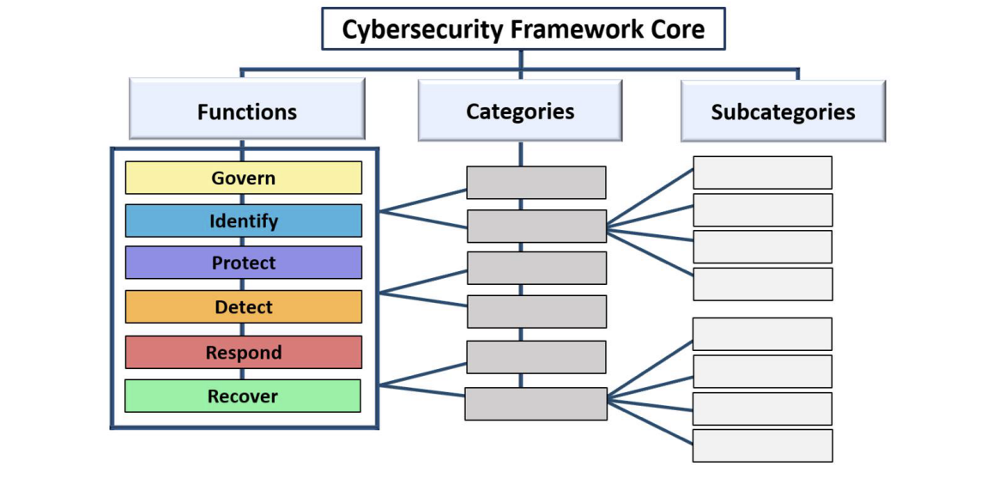
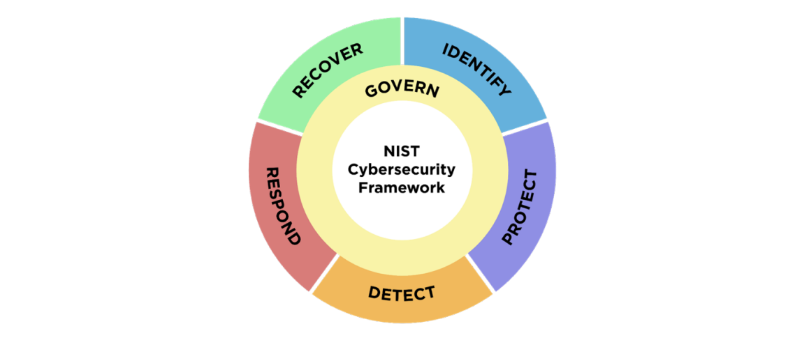
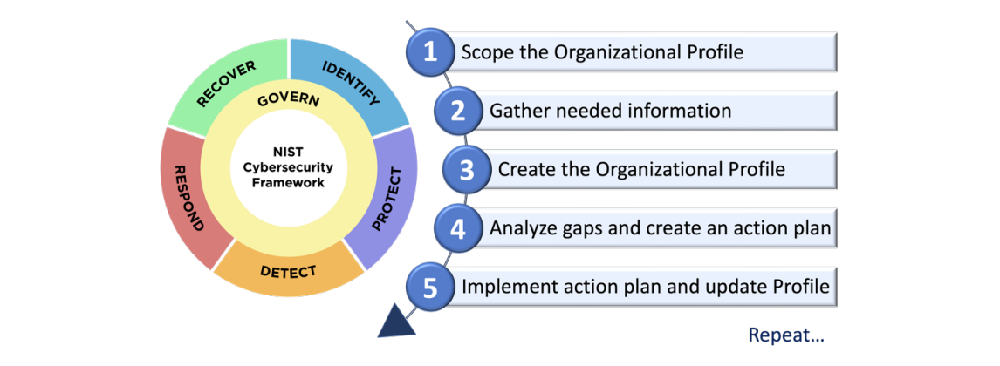
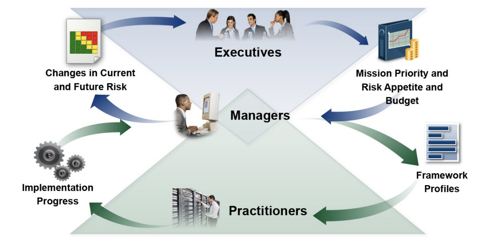

<b>摘要</b>

NIST 网络安全框架（CSF 2.0）为行业、政府机构和其他组织提供网络安全风险管理指南。它提供了高级别网络安全结果分类法，任何组织（无论其规模、所属行业或成熟度如何）均可使用，以更好地理解、评估、确定优先级并沟通其网络安全工作。CSF 并未规定如何实现成果（outcomes），而是提供了在线资源链接，这些资源提供了有关可用于实现这些结果的实践和控制措施的额外指导。本文档介绍了 CSF 2.0、其组件以及一些使用方法。

<b>关键词</b>

网络安全；网络安全框架（CSF）；网络安全风险治理；网络安全风险管理；企业风险管理；配置；层级。

<b>受众</b>

负责制定和领导网络安全项目的人员是 CSF 的主要受众。其他参与风险管理的人员（包括高层、董事会、采购人员、技术专业人员、法务、人力资源以及审计师）也可以使用 CSF 来指导其网络安全相关决策。此外，CSF 还对那些制定和影响政策的人员（例如，协会、专业组织和监管机构）有所帮助，他们负责设定和传递网络安全风险管理的优先级。

<b>补充资源</b>

NIST 将继续构建和托管更多资源，以帮助各组织实施 CSF，包括快速入门指南和社区配置文件。所有资源均在 [NIST CSF 网站](https://www.nist.gov/cyberframework)上公开发布。任何关于在 NIST CSF 网站上其他资源的建议，请随时通过 [cyberframework@nist.gov](mailto:cyberframework@nist.gov) 与 NIST 分享。

<b>读者须知</b>

除非另有说明，本出版物中引用、参考或摘录的文件并未全部纳入本出版物。在 2.0 版之前，网络安全框架被称为“关键基础设施网络安全改进框架”。CSF 2.0 不再使用此名称。

<b>致谢</b>

CSF 是美国及全球工业界、学术界和政府部门多年合作的成果。NIST 感谢所有为修订版 CSF 做出贡献的人员。有关 CSF 开发过程的信息可在 [NIST CSF 网站](https://www.nist.gov/cyberframework)上找到。使用 CSF 的经验总结可随时通过 [cyberframework@nist.gov](mailto:cyberframework@nist.gov) 与 NIST 分享。

<b>前言</b>

网络安全框架（CSF）2.0‌ 旨在帮助各类规模与行业的组织（包括工业界、学术界、政府和非营利组织）管理和降低网络安全风险‌。其适用性不受组织网络安全计划的成熟度水平或技术复杂性限制‌。然而，该框架并非采用“一刀切”的方法‌。每个组织既面临共性的风险，也存在独特的威胁，同时具备差异化的风险偏好、容忍度、特定使命及实现这些使命的目标‌。因此，组织在实施CSF时的具体方式必然存在差异‌。

理想情况下，CSF 适用于应对网络安全风险以及企业的其他风险，包括财务、隐私、供应链、声誉、技术或物理风险。

CSF 设定的预期成果应能被广泛受众理解（涵盖高层、管理者及执行者），无论其是否具有网络安全专业知识。这些成果因具有行业、地域及技术中立性，使组织能灵活应对其特有风险、技术及使命需求。此外，框架将成果直接映射至可立即实施的安全控制措施清单，以快速降低网络安全风险‌。

尽管 CSF 并非强制性标准，但其旨在帮助用户了解并选择特定目标成果。关于如何实现这些成果的建议，可通过与 CSF 配套的、不断扩展的在线资源库获取，其中包括一系列‌**快速入门指南（QSGs）**‌。此外，多种工具提供可下载的模板，助力选择自动化部分流程的组织。QSGs 提出了使用 CSF 的初步方法，并鼓励读者深入探索 CSF 及相关资源。CSF 以及来自 NIST 和其他机构的补充资源可通过 [NIST CSF 网站](https://www.nist.gov/cyberframework)获取，它们应被视为“CSF资源组合”，以协助管理和降低风险。无论采用何种应用方式，CSF 均会引导用户基于自身情境评估网络安全态势，并据此调整框架以满足特定需求。

CSF 2.0 在先前版本基础上，新增了强调‌**治理**‌与‌**供应链**‌重要性的功能。为确保框架对小型组织及大型机构均具有相关性和易用性，QSGs 得到特别优化。NIST 现提供在线且定期更新的‌**实施案例**‌和‌**参考信息**‌。通过创建当前状态与目标状态的‌**组织配置**‌，组织可对比现状与预期目标的差距，从而更快实施并评估安全控制措施。

## 1 CSF 概述

本文档是 NIST 网络安全框架（框架或 CSF）的 2.0 版。它包括以下组件：

- ***CSF Core***，CSF 核心，也是高级网络安全成果集合（Outcome）的分类法，可帮助任何组织管理其网络安全风险。CSF Core 组件是功能、类别和子类别的层次结构，详细说明了每个成果。这些成果可以被广泛的受众理解，包括高层、管理者和执行者，无论他们是否具有网络安全专业知识。由于这些成果与行业、国家和技术无关，因此它们为组织提供了解决其独特风险、技术和任务考虑所需的灵活性。
- ***CSF Profiles***，组织配置，这是一种根据 CSF 核心的结果成效描述组织当前和未来（目标）网络安全态势的机制。
- ***CSF Tiers***，CSF 层级，可应用于 CSF 组织配置，以描述组织网络安全风险治理和管理实践的严谨性。层级还可以为组织如何看待网络安全风险以及管理这些风险的现有流程提供背景信息。

本文档描述了组织期望可以实现的理想成果。它不规定成果是什么，也不规定如何实现这些成果。有关组织如何实现这些成效的描述在一系列在线资源中提供，这些资源是对 CSF 的补充，可通过 [NIST CSF 网站](https://www.nist.gov/cyberframework)获取。这些资源提供了可用于实现结果成效的实践和控制的额外指导，旨在帮助组织理解、采纳和使用 CSF。它们包括：

- [*参考信息*](https://www.nist.gov/cyberframework/csf-20-informative-references)，指出全球现有标准、指南、框架、法规、政策等对每种成果的指导来源。 
- [*实施案例*](https://www.nist.gov/document/csf-20-implementation-examples-xlsx)，说明实现每种成效的潜在方法。
- [*快速入门指南*](https://www.nist.gov/cyberframework/navigating-nists-csf-20-quick-start-guides)，提供有关使用 CSF 及其在线资源的可行性指导，包括从以前的 CSF 版本过渡到 2.0 版。
- [*社区和组织配置模板*](https://www.nist.gov/cyberframework/csf-20-profiles)，帮助组织将 CSF 付诸实践并设定管理网络安全风险的优先事项。

组织可以使用 CSF 核心、配置文件和层级以及补充资源来了解、评估、确定优先级并传递网络安全风险。

- **了解和评估**：描述组织部分或全部的当前或目标网络安全态势，确定差距，并评估解决这些差距的进展情况。
- **确定优先级**：识别、梳理和确定网络安全风险管理行动措施的优先级，确保其与组织使命、法律法规要求、风险管理和治理预期保持协调一致。
- **沟通**：为组织内外部沟通网络安全风险相关的能力建设、需求及预期目标建立通用术语体系。

CSF 设计适用于各类规模及行业组织，包括工业界、学术界、政府部门及非营利机构，不受其网络安全计划的成熟度等级限制。该框架作为基础性资源，可通过自愿采纳或政府政策与强制性规定实施。CSF 分类体系及其参考标准、指南与实践不针对特定国家，其早期版本已在美国境内外多个政府机构及其他组织中成功应用。

CSF 应与其他资源（如各类框架、标准、指南及行业最佳实践）结合使用，以优化网络安全风险管理，并为企业在信息与通信技术（ICT）风险的整体治理提供决策支撑。CSF 框架具有灵活特性，可针对不同规模组织的实际需求进行定制。各组织将持续面临独特风险（包括差异化威胁、漏洞及风险承受度），以及特有的使命目标与合规要求。因此，组织在风险管理的方法路径及 CSF 框架的实施方式上存在差异性。

本文档的其余部分结构如下：

- 第 2 章介绍 CSF 核心的基础知识：功能、类别和子类别。
- 第 3 章定义 CSF 配置文件和层级的概念。
- 第 4 章概述了 CSF 在线资源套件的选定组件：参考信息、实施案例和快速入门指南。
- 第 5 章讨论组织如何将 CSF 与其他风险管理计划集成。
- 附录 A 是 CSF 核心。
- 附录 B 包含 CSF 层级的概念说明。
- 附录 C 是 CSF 术语表。

## 2 CSF 核心

附录 A 是 CSF 核心，一组按功能（Function）、类别（Category）和子类别（Subcategory）排列的网络安全成效，如图 1 所示。这些成果集合不是要执行的行动清单；为实现成果而采取的具体行动将因组织和用例而异，负责这些行动措施的个人也将有所不同。此外，核心中功能、类别和子类别的顺序和大小并不意味着实现它们的顺序或重要性。核心的结构旨在与负责在组织内实施风险管理的人员产生最大共鸣。

CSF 核心功能由 6 个顶层功能模块构成：治理、识别、保护、检测、响应和恢复

- **治理（GOVERN，GV）**：建立、传递和监控组织的网络安全风险管理战略、期望和政策。治理功能提供成果，以告知组织可以采取哪些措施来实现其他五个职能的成果，并根据其使命和利益相关者的期望确定其优先顺序。治理活动对于将网络安全纳入组织更广泛的企业风险管理 (ERM) 战略至关重要。治理涉及对组织背景的理解；网络安全战略和网络安全供应链风险管理的建立；角色、职责和权限；政策；以及对网络安全战略的监督。
- **识别（IDENTIFY，ID）**：了解组织当前的网络安全风险。通过系统性识别组织的资产（包括数据、硬件、软件、系统、设施、服务、人员）、供应链实体及其关联的网络安全风险，可使组织依据其风险管理战略及治理（GOVERN）职能界定的使命需求，对防护工作进行科学优先级排序‌。该模块还包括识别组织在网络安全风险管理相关领域的改进机会，涵盖政策体系、规划方案、流程设计、操作规程及实践方法等维度，旨在为六大职能模块的实施提供持续优化依据‌。
- **保护（PROTECT，PR）**：通过使用保障措施来管理组织的网络安全风险。一旦资产和风险被识别并确定优先级，保护模块通过保护这些资产的能力，防止或降低不利网络安全事件发生的可能性及影响，同时提升组织在数字化转型中把握新兴技术机遇的能力‌。该职能涵盖的成果包括：身份管理、身份验证与访问控制；意识提升与培训；数据安全；平台安全（即保护物理和虚拟平台的硬件、软件及服务）；以及技术基础设施的韧性。
- **检测（DETECT，DE）**：发现并分析可能的网络攻击与入侵行为。检测模块能够及时发现和分析异常活动、入侵指标（IoC）及其他可能表明网络安全攻击或事件正在发生的潜在威胁信号，为事件响应与恢复行动提供关键支撑。
- **响应（RESPOND，RS）**：针对已检测到的网络安全事件采取行动。响应模块旨在遏制网络安全事件的影响，包括事件管理、分析、缓解、影响报告及内外部沟通等环节。
- **恢复（RECOVER，RC）**：修复受网络安全事件影响的资产并恢复正常运营。恢复模块通过及时恢复业务运营，降低网络安全事件的负面影响，并在恢复过程中确保利益相关方的信息同步与协调沟通。

| 尽管众多网络安全风险管理活动聚焦于预防负面事件的发生，但它们亦可能助力组织把握积极机遇‌。降低网络安全风险的措施可通过其他方式使组织受益，例如提升收入（如：首先将冗余设施空间提供给商业托管服务商，用于托管其自身及其他机构的数据；随后将核心财务系统从组织内部数据中心迁移至该托管服务商，以降低网络安全风险）‌。 |
| ------------------------------------------------------------ |

图 2 将 CSF 功能模块以轮形图形式呈现，原因是所有职能相互关联。例如，组织会在‌**识别（IDENTIFY）**‌职能中对资产进行分类，并在‌**保护（PROTECT）**‌功能模块中采取措施保护这些资产；在‌**治理（GOVERN）**‌和‌**识别（IDENTIFY）**‌模块中对规划与测试的投入，将支持‌**检测（DETECT）**‌模块中及时发现意外事件，并赋能‌**响应（RESPOND）**‌和‌**恢复（RECOVER）**‌模块中对网络安全事件的响应与恢复行动；**治理（GOVERN）**‌位于轮形图中心，因为它决定了组织如何实施其他五项职能。

所有功能模块需同步实施。支持‌**治理（GOVERN）**‌、‌**识别（IDENTIFY）**‌、‌**保护（PROTECT）**‌与‌**检测（DETECT）**‌的行动应持续开展，而支持‌**响应（RESPOND）**‌与‌**恢复（RECOVER）**‌的行动则需随时待命，并在网络安全事件发生时启动。所有功能均对网络安全事件管理具有关键作用：治理、识别和保护的结果有助于预防事件和做好准备，而治理、检测、响应和恢复的结果有助于发现和管理事件。

每个功能模块均以动词命名，概括其核心内容。每个职能进一步划分为若干‌类别（Categories）‌，这些类别代表与该功能相关的网络安全目标，共同构成该模块的整体框架。‌子类别（Subcategories）‌则对每个类别进行更细粒度的划分，描述支持实现该类别目标的具体技术活动与管理措施。子类别并非穷尽所有可能，但明确列出了支撑每个类别的详细目标。

功能、类别和子类别适用于组织使用的所有 ICT，包括信息技术 （IT）、物联网 （IoT）和运营技术 （OT）。它们还适用于所有类型的技术环境，包括云、移动和人工智能。CSF 核心具有前瞻性，旨在适用于未来的技术和环境变化。

## 3 CSF 配置和层级

本章确定 CSF 配置和层级的定义。

### 3.1 CSF 配置

CSF 组织配置（Profiles）根据核心成果描述了组织当前和/或目标网络安全态势。[组织配置](https://www.nist.gov/cyberframework/csf-20-profiles)通过整合组织的‌使命目标‌、‌利益相关方期望‌、‌威胁环境及‌合规要求，用于理解、定制、评估、优先级排序及沟通 CSF 核心成果。基于此，组织可明确需优先实施的安全行动，并向利益相关方传递关键网络安全信息。

每个组织配置都包括以下一项或两项：

1. *当前配置* 指定组织当前正在实现（或试图实现）的核心成果，并描述实现每个成果的方式或程度。
2. *目标配置* 指定组织为实现其网络安全风险管理目标而选择和优先考虑的期望成果。目标配置考虑了组织网络安全态势的预期变化，例如新要求、新技术使用和威胁情报趋势。

| 社区配置是 CSF 成果的基线，其创建和发布是为了解决多个组织之间的共同利益和目标。社区配置通常是针对特定行业、子行业、技术、威胁类型或其他用例开发的。组织可以使用社区配置作为其自身目标配置的基础。社区配置的示例可以在 [NIST CSF 网站](https://www.nist.gov/cyberframework)上找到。 |
| ------------------------------------------------------------ |

图 3 中所示的步骤以及下面总结的步骤说明了一种组织可以使用组织配置来帮助持续改进其网络安全持的方法。

1. **确定组织配置的范围**。记录文档作为配置范围定义基础的高层次事实与假设。组织可创建任意数量的组织配置，每个配置范围不同。例如，一个配置可覆盖整个组织，或限定于组织的财务系统，或专门应对涉及这些财务系统的勒索软件威胁及事件处理。
2. **收集准备组织配置所需的信息**。信息示例可包括：组织政策、风险管理优先级与资源、企业风险概况、业务影响分析（BIA）登记册、组织遵循的网络安全要求与标准、实践与工具（如程序及防护措施）、以及工作岗位职责。
3. ‌**创建组织配置**‌。确定配置应针对所选 CSF 成果包含的信息类型，并记录必要信息。需结合当前配置的风险影响，为目标配置规划及优先级排序提供依据。同时，可考虑将社区配置作为目标配置的基础。
4. **分析当前与目标配置的差距并制定行动计划**‌。进行差距分析，以确定和分析当前配置与目标配置之间的差异，并制定优先行动计划（如风险登记册、风险详情报告、行动与里程碑计划[POA&M]）以解决差距。
5. **实施行动计划并更新组织配置**‌。遵循行动计划解决差距，推动组织向目标配置迈进。行动计划可设定整体截止期限，也可持续执行。

鉴于持续改进的重要性，组织可以根据需要重复这些步骤。

组织配置还有其他用途。例如，当前配置可用于记录和传递组织的网络安全能力以及已知的改进机会，并与外部利益相关者（如业务合作伙伴或潜在客户）沟通。此外，目标配置可帮助向供应商、合作伙伴及其他第三方阐明组织的网络安全风险管理要求与期望，作为其需达成的目标。

### 3.2 CSF 层级

组织可选择使用‌层级（Tiers）‌来指导其当前配置与目标配置的制定。层级用于描述组织网络安全风险治理及管理实践的严谨程度，并为组织如何看待网络安全风险及现有风险管理流程提供背景依据。如图 4 所示（附录 B 中亦有示意性说明），层级将组织的网络安全风险管理实践划分为四个等级：非正式级（Tier 1）‌、风险知情级（Tier 2）‌、可重复级（Tier 3）‌和自适应级（Tier 4）‌。这些层级反映了从非正式、临时性的响应方式，逐步向敏捷、风险驱动且持续改进的方法演进的路径。选择层级有助于为组织的网络安全风险管理设定整体基调。

层级（Tiers）应作为组织网络安全风险管理方法的补充，而非替代。例如，组织可将层级作为内部沟通的基准，用于统一全组织范围内（在本文件中，“全组织范围（organization-wide）”与“企业级（enterprise）”含义相同。）的网络安全风险管理方法。当风险或法规要求更高时，或当成本效益分析表明存在可行且具有成本效益的负面网络安全风险降低措施时，建议向更高层级推进。

[NIST CSF 网站](https://www.nist.gov/cyberframework)提供了有关使用配置和层级的更多信息。它包括指向 [NIST 托管的组织配置模版](https://www.nist.gov/cyberframework/csf-20-profiles)，以及各种机器可读（如 JSON、XML）和用户友好（如 PDF、Excel）的[社区配置存储库](https://www.nist.gov/cyberframework/csf-20-profiles)。

## 4 在线补资源

NIST 和其他组织已经制作了一套在线资源，帮助组织了解、采纳和使用 CSF。由于这些附加资源是在线托管的，因此它们可以比本文档更新得更频繁，而本文档的更新频率不高，以向用户提供稳定性，并以机器可读的格式提供。本节概述了三种类型的在线资源：参考信息、实施案例和快速入门指南。

[参考信息（Informative References）](https://www.nist.gov/cyberframework/csf-20-informative-references)是用于建立 CSF 核心与其他标准、指南、法规等内容的关联映射。它们可辅助组织理解如何实现 CSF 核心中的预期成果‌，并可能针对特定行业或技术领域。这类资料可由 NIST 或其他机构制定‌。部分参考信息的范围比子类别（Subcategory）更狭窄，例如 [NIST SP 800-53《信息系统与组织安全隐私控制》](https://csrc.nist.gov/publications/detail/sp/800-53/rev-5/final)中的单项控制措施可能需要结合多项参考信息才能满足某子类别的成果要求‌。另一些参考资料则具有更高层级，例如某项政策要求可能覆盖多个子类别的部分内容‌。组织在使用 CSF 时，需筛选与其需求最相关的参考信息。

[实施案例（Implementation Examples）](https://www.nist.gov/document/csf-20-implementation-examples-xlsx)通过概念性案例提供简明、行动导向的步骤，以帮助实现子类别（Subcategory）的预期成果‌。这些案例使用‌分享、记录、制定、执行、监控、分析、评估、演练等动词描述具体行动‌。这些案例并非涵盖组织为实现成果可采取的所有行动的完整清单‌，也不代表应对网络安全风险所需行动的基线要求‌。

[快速入门指南 （Quick-Start Guides，QSGs）](https://www.nist.gov/cyberframework/navigating-nists-csf-20-quick-start-guides)是关于特定 CSF 相关主题的简短文档，通常针对特定受众量身定制。QSG 可以帮助组织实施 CSF，因为它们将 CSF 的特定部分提炼为可操作的“第一步”，组织可以在改善网络安全态势和相关风险管理的过程中考虑这些步骤。指南会根据自己的时间框架进行修订，并根据需要添加新指南。

关于 CSF 2.0 新增参考信息的建议可随时提交至邮箱 [‌olir@nist.gov‌](mailto:olir@nist.gov)。若需提议在 NIST CSF 官网引用的其他资源（包括新增快速入门指南主题），请将建议发送至 ‌[cyberframework@nist.gov](mailto:yberframework@nist.gov)‌。

## 5 优化网络安全风险沟通与计划整合‌

CSF 的应用因组织的独特使命和风险而异。通过理解利益相关方期望及风险偏好与承受能力（如‌ GOVERN‌ 所述），组织可优先处理网络安全活动，从而为网络安全支出与行动做出知情决策。根据潜在影响和可能性，组织可选择一种或多种方式应对风险——包括‌减轻、转移、规避或接受负面风险‌，以及‌实现、分享、增强或接受正面风险‌。重要的是，组织既可在内部使用CSF 管理自身网络安全能力，也可在外部用于监督或与第三方沟通。

无论 CSF 如何应用，组织均可将其作为指导工具，帮助理解、评估、优先处理和沟通网络安全风险及应对措施。所选成果可用于聚焦并落实战略决策，从而改善网络安全态势，并在考虑优先级与可用资源的同时，保障关键业务功能的连续性。

## 5.1 优化风险管理沟通‌

CSF 为改进网络安全期望、规划及资源沟通提供了基础‌。通过促进‌双向信息流‌（如图 5 上半部分所示），CSF 连接了关注组织优先级与战略方向的高层管理者，以及管理可能影响这些优先级实现的特定网络安全风险的中层管理者‌。此外，CSF 还支持中层管理者与负责技术实施及运维的执行者（如工程师）之间的类似信息流（如图 5 下半部分所示）‌。图左侧强调了负责具体业务的工程师向管理层及高层共享更新、见解与关切的重要性‌。

创建和使用组织配置需要从高层收集有关组织优先级、资源及风险方向的信息。随后，管理者与执行者协作沟通业务需求，制定基于风险识别的组织配置。针对现状与目标配置之间的差距，管理者与执行者将实施弥补行动，并为系统级计划提供关键输入。随着目标状态在整个组织内达成（包括通过系统级控制与监控实现），更新结果可通过风险登记册和进度报告共享。作为持续评估的一部分，管理者将获得见解以进行调整，从而进一步减少潜在危害并提升潜在收益。

治理（GOVERN）功能模块支持组织与高层的风险沟通‌。高层的讨论聚焦战略议题，尤其是网络安全相关的不确定性如何影响组织目标的实现‌。此类治理对话推动各方就风险管理策略（包括网络安全供应链风险）、角色职责与权限、政策制定及监督机制达成共识‌。基于这些需求，高层需明确网络安全优先级与目标，并传递关于风险偏好、问责机制及资源分配的预期‌。此外，高层负责将网络安全风险管理与企业风险管理（ERM）计划及下级风险管理计划整合（参见第 5.2 节）‌。图 5 上半部分所示的沟通内容可涵盖对 ERM 及下级计划的考量，从而为管理者与执行者提供信息支持‌。

高层设定的总体网络安全目标由**管理人员**告知并逐级传达。在商业实体中，这些目标可能适用于业务线或运营部门。对于政府实体，这些目标可能涉及部门或分支机构。管理者在实施 CSF 时，将聚焦如何通过通用服务、控制措施及协作实现风险目标（如目标配置所述），并通过行动计划中跟踪的行动（例如风险登记册、风险详细报告、POA&M 等）进行优化。

**执行者**专注于实现目标状态并衡量运营风险的变化，以规划、执行和监控特定的网络安全活动。在实施控制措施以将风险控制在可接受的水平时，执行者为管理者和高层提供他们需要的信息（例如关键绩效指标、关键风险指标），以了解组织的网络安全状况，做出明智的决策，并相应地维持或调整风险策略。高层还可以将这些网络安全风险数据与整个组织中其他类型风险的信息相结合。随着周期循环，更新后的组织配置将包含调整后的预期与优先级。

### 5.2 加强与其他风险管理计划的整合‌

每个组织都面临着多种类型的 ICT 风险（如隐私、供应链、人工智能），并可能针对各类风险采用特定框架与管理工具。部分组织通过企业风险管理（ERM）在高层级整合 ICT 与其他所有风险管理举措；另一些组织则采取独立管理模式，以确保对每类风险投入足够的关注。小型组织因其体量特性或可在企业层级统一监控风险，而大型企业可能采取独立风险管理运作，再整合至 ERM 体系中。

组织可以采用 ERM 方法来平衡包括网络安全在内的一系列风险考虑因素，并做出明智的决策。高层在将治理与风险策略同先前应用 CSF 的成果相整合时，会收到有关当前和计划的风险活动的重要意见。CSF 可协助组织将网络安全及网络安全风险管理术语转化为高层能够理解的通用风险管理语言。

描述网络安全风险管理和 ERM 之间相互关系的 NIST 资源包括：

- NIST 网络安全框架 2.0 —— [企业风险管理快速入门指南](https://doi.org/10.6028/NIST.SP.1303.ipd)
- NIST 跨部门报告（IR）8286：[《网络安全与企业风险管理（ERM）整合》‌](https://csrc.nist.gov/publications/detail/nistir/8286/final)
- IR 8286A：[《企业风险管理中的网络安全风险识别与评估》‌](https://doi.org/10.6028/NIST.IR.8286A)
- IR 8286B：[《企业风险管理中的网络安全风险优先级划分》‌](https://doi.org/10.6028/NIST.IR.8286B)
- IR 8286C：[《企业风险管理与治理监督的网络安全风险分阶段管理》‌](https://doi.org/10.6028/NIST.IR.8286C-upd1)
- IR 8286D：[《利用业务影响分析（BIA）指导风险优先级划分与应对》‌](https://doi.org/10.6028/NIST.IR.8286D)
- SP 800-221：[《信息与通信技术（ICT）风险对企业的影响：企业风险投资组合中的ICT风险管理计划治理与管理》‌](https://doi.org/10.6028/NIST.SP.800-221)
- SP 800-221A：[《信息与通信技术（ICT）风险成果：ICT风险管理计划与企业风险投资组合的整合》‌](https://doi.org/10.6028/NIST.SP.800-221A)

组织还可能发现 CSF 有利于将网络安全风险管理与单个 ICT 风险管理计划相结合，例如：

- **网络安全风险管理与评估**：CSF 可以与现有的网络安全风险管理与评估计划相结合，例如 [SP 800-37《信息系统和组织的风险管理框架》](https://doi.org/10.6028/NIST.SP.800-37r2)和 [SP 800-30《NIST 风险管理框架 (RMF) 中的风险评估指南》](https://doi.org/10.6028/NIST.SP.800-30r1)。对于使用 [NIST RMF 及其出版物套件的组织](https://csrc.nist.gov/Projects/risk-management/publications)，CSF 可用于补充 RMF 选择和优先考虑 [SP 800-53《信息系统和组织的安全和隐私控制》](https://doi.org/10.6028/NIST.SP.800-53r5)中的控制方法。

- **隐私风险**：虽然网络安全和隐私是独立的学科，但在某些情况下它们的目标会重叠，如图 6 所示。

  网络安全风险管理‌对于解决与个人数据机密性、完整性和可用性丧失相关的隐私风险至关重要。例如，数据泄露可能导致身份盗用。然而，隐私风险也可能通过非网络安全事件的方式产生。

  组织为实现使命或业务目的而处理数据时，有时会引发隐私事件，导致个人因数据处理而遭受问题。这些问题可通过多种方式体现，但 NIST 将其描述为从尊严类影响（如尴尬或污名化）到实际损害（如歧视、经济损失或人身伤害）的范围。‌[NIST 隐私框架‌](https://www.nist.gov/privacy-framework)与‌网络安全框架‌可结合使用，以应对网络安全和隐私风险的不同方面。此外，NIST 的‌[隐私风险评估方法（PRAM）](https://www.nist.gov/itl/applied-cybersecurity/privacy-engineering/resources)‌提供了一份示例问题目录，用于隐私风险评估。

- **供应链风险‌**：组织可利用 CSF 加强对供应链中各相关方的网络安全风险监督与沟通。所有技术均依赖一个复杂、全球分布、广泛且相互关联的供应链生态系统，其路径地理分布广泛，且包含多层级的外包。该生态系统由公共和私营部门实体（如采购方、供应商、开发商、系统集成商、外部系统服务提供商及其他技术相关服务提供商）构成，这些实体通过互动参与技术产品与服务的研究、开发、设计、制造、采购、交付、集成、运营、维护、处置以及其他方式使用或管理活动。这些互动受到技术、法律、政策、流程及实践的影响。

  鉴于此生态系统中复杂且相互关联的关系，供应链风险管理（SCRM）对组织至关重要。网络安全 SCRM（C-SCRM）是一个系统化的过程，用于管理整个供应链中的网络安全风险，并制定适当的响应策略、政策、流程和程序。CSF C-SCRM 类别 [GV.SC] 中的子类别将纯粹关注网络安全的结果与关注 C-SCRM 的结果联系起来。[NIST SP 800-161r1《系统与组织的网络安全供应链风险管理实践》](https://csrc.nist.gov/pubs/sp/800/161/r1/final)为C-SCRM提供了深入指导‌。

- ‌**新兴技术风险**‌：随着新技术及其新应用的出现，新的风险逐渐显现‌。当前典型案例是人工智能（AI），其不仅存在网络安全与隐私风险，还涉及其他多种风险类型‌。NIST 制定了[《人工智能风险管理框架（AI RMF）》](https://www.nist.gov/itl/ai-risk-management-framework)以应对此类风险‌。将 AI 风险与其他企业风险（如金融、网络安全、声誉及隐私风险）协同管理，可实现更一体化的成果并提升组织效率‌。网络安全与隐私风险管理的考量和方法适用于 AI 系统的设计、开发、部署、评估及使用。AI RMF 核心通过“功能”（Functions）、“类别”（Categories）及“子类”（Subcategories）描述 AI 治理目标，并帮助管理与 AI 相关的风险‌。

## 附录 A：CSF Core

本附录描述了 CSF 核心的功能、类别和子类别。表 1 列出了 CSF 2.0 核心功能和类别名称以及唯一的字母标识符。表中的每个功能名称都链接到附录的相应部分。核心的功能、类别和子类别的顺序不是按字母顺序排列的；其目的是让负责在组织内实施风险管理的人员易于理解。子类别的编号有意不按顺序排列；编号中的间隙表示在 CSF 2.0 中重新定位的 CSF 1.1 子类别

**表1 CSF 2.0核心功能和类别名称和标识符**

| **功能**（Function） | **类别**（Category）     | **类别标识符**（Category Identifier） |
| -------------------- | ------------------------ | ------------------------------------- |
| **治理（GV）**       | 组织背景                 | GV.OC                                 |
|                      | 风险管理策略             | GV.RM                                 |
|                      | 角色、职责和权限         | GV.RR                                 |
|                      | 政策                     | GV.PO                                 |
|                      | 监督                     | GV.OV                                 |
|                      | 网络安全供应链风险管理   | GV.SC                                 |
| **识别（ID）**       | 资产管理                 | ID.AM                                 |
|                      | 风险评估                 | ID.RA                                 |
|                      | 改进                     | ID.IM                                 |
| **保护（PR）**       | 身份管理、验证和访问控制 | PR.AA                                 |
|                      | 意识和培训               | PR.AT                                 |
|                      | 数据安全                 | PR.DS                                 |
|                      | 平台安全                 | PR.PS                                 |
|                      | 技术基础设施的韧性       | PR.IR                                 |
| **检测（DE）**       | 持续监控                 | DE.CM                                 |
|                      | 负面事件分析             | DE.AE                                 |
| **响应（RS）**       | 事件管理                 | RS.MA                                 |
|                      | 事件分析                 | RS.AN                                 |
|                      | 事件响应报告和沟通       | RS.CO                                 |
|                      | 事件缓解                 | RS.MI                                 |
| **恢复（RC）**       | 事件恢复计划执行         | RC.PR                                 |
|                      | 事件恢复沟通             | RC.CO                                 |

CSF 核心、参考信息和实施案例可在 [CSF 2.0 网站](https://www.nist.gov/cyberframework)和 [CSF 2.0 参考工具](https://csrc.nist.gov/Projects/Cybersecurity-Framework/Filters#/csf/filters)中找到，用户可借此探索这些内容并将其导出为人机可读格式。CSF 2.0 核心还提供了与 CSF 1.1 类似的[传统格式](https://csrc.nist.gov/extensions/nudp/services/json/csf/download?olirids=)。

| 治理 (GV)：建立、传递和监控组织的网络安全风险管理战略、期望和政策 |
| ------------------------------------------------------------ |
| ‌**组织背景（GV.OC）**‌：了解组织的网络安全风险管理决策所处的环境 —— 使命、利益相关者的期望、依赖关系以及法律、法规和合同要求。 - **GV.OC-01**‌：了解组织使命，并纳入网络安全风险管理框架‌ - **GV.OC-02**‌：了解内部和外部利益相关者，考虑他们对网络安全风险管理的需求和期望‌ - **GV.OC-03**‌：了解和管理有关网络安全的法律、法规和合同要求 — 包括隐私和公民自由义务‌ - **GV.OC-04**：了解并传达外部利益相关者所依赖或期望组织提供的关键目标、能力和服务 - **GV.OC-05**：了解并传递组织所依赖的成果、能力和服务 |
| **风险管理策略 （GV.RM）**：建立、传递组织的优先事项、约束、风险承受能力和偏好声明以及假设，并将其用于支持运营风险决策 - **GV.RM-01**：建立风险管理目标并获得组织利益相关者的同意 - **GV.RM-02**：建立、传递和维护风险偏好和风险承受能力声明 - **GV.RM-03**：将网络安全风险管理活动和结果纳入企业风险管理流程 - **GV.RM-04**：建立并传递描述适当风险应对方案的战略方向 - **GV.RM-05**：为网络安全风险（包括来自供应商和其他第三方的风险）建立整个组织的沟通渠道 - **GV.RM-06**：建立并传达用于计算、记录、分类和确定网络安全风险优先级的标准化方法 - **GV.RM-07**：对战略机遇（即积极风险）进行特征描述并将其纳入组织网络安全风险讨论中 |
| **角色、职责和权限（GV.RR）**：建立并传递网络安全角色、职责和权限，以促进问责、绩效评估和持续改进 - **GV.RR-01**：组织领导层对网络安全风险负责，培养具有风险意识、道德和持续改进的文化 - **GV.RR-02**：建立、传递、理解和执行与网络安全风险管理相关的角色、职责和权限 - **GV.RR-03**：根据网络安全风险战略、角色、职责和政策分配充足的资源 - **GV.RR-04**：将网络安全纳入人力资源实践 |
| **政策 （GV.PO）**：建立、传递和执行组织网络安全政策 - **GV.PO-01**：根据组织背景、网络安全战略和优先事项建立网络安全风险管理政策，并传递和执行 - **GV.PO-02**：审查、更新、传递和执行网络安全风险管理政策，以反映需求、威胁、技术和组织使命的变化 |
| **监督（GV.OV）**：整个组织的网络安全风险管理活动和绩效的结果用于通知、改进和调整风险管理策略 - **GV.OV-01**：审查网络安全风险管理策略结果以通知和调整策略和方向 - **GV.OV-02**：审查和调整网络安全风险管理策略以确保覆盖组织的要求和风险 - **GV.OV-03**：评估和审查组织网络安全风险管理绩效以确定需要调整的内容 |
| **网络安全供应链风险管理 （GV.SC）**：组织利益相关者识别、建立、管理、监控和改进网络供应链风险管理流程 - **GV.SC-01**：建立并经组织利益相关者同意的网络安全供应链风险管理计划、战略、目标、政策和流程 - **GV.SC-02**：建立、传递并在内外部协调供应商、客户和合作伙伴的网络安全角色和职责 - **GV.SC-03**：将网络安全供应链风险管理融入网络安全和企业风险管理、风险评估和改进流程 - **GV.SC-04**：了解供应商并按重要性确定其优先级 - **GV.SC-05**：建立、确定优先级，并将解决供应链中网络安全风险的要求融入与供应商和其他相关第三方签订的合同或其他类型的协议中 - **GV.SC-06**：在建立正式的供应商或其他第三方关系之前，进行规划和尽职调查以降低风险 - **GV.SC-07**：供应商、其产品和服务以及其他第三方在沟通过程中得到理解、记录、优先排序、评估、响应和监控 - **GV.SC-08**：相关供应商和其他第三方纳入事件规划、响应和恢复活动 - **GV.SC-09**：供应链安全实践融入网络安全和企业风险管理计划，并在整个技术产品和服务生命周期内进行监控 - **GV.SC-10**：网络安全供应链风险管理计划包括合作伙伴关系或服务协议签订后发生的活动的规定 |

| 识别（ID）：了解组织当前的网络安全风险                       |
| ------------------------------------------------------------ |
| **资产管理 （ID.AM）**：对使组织能够实现业务目的的资产（例如数据、硬件、软件、系统、设施、服务、人员）进行识别和管理，并使其与组织目标和组织风险战略的相对重要性保持一致 - **ID.AM-01**：维护组织管理的硬件清单 - **ID.AM-02**：维护组织管理的软件、服务和系统的清单 - **ID.AM-03**：维护组织授权的网络通信和内部和外部网络数据流的表示 - **ID.AM-04**：维护供应商提供的服务的清单 - **ID.AM-05**：根据分类、关键性、资源和对任务的影响对资产进行优先排序 - **ID.AM-07**：维护指定数据类型的数据和相应元数据的清单 - **ID.AM-08**：在系统、硬件、软件、服务和数据的整个生命周期中进行管理 |
| **风险评估 （ID.RA）**：组织了解整个组织、资产和个人的网络安全风险 - **ID.RA-01**：识别、验证和记录资产中的漏洞 - **ID.RA-02**：从信息共享论坛和其他来源获取网络威胁情报 - **ID.RA-03**：识别和记录对组织的内外部威胁 - **ID.RA-04**：识别和记录利用漏洞的威胁的潜在影响和可能性 - **ID.RA-05**：利用威胁、漏洞、可能性和影响来了解固有风险并确定风险响应优先级 - **ID.RA-06**：选择、确定优先级、规划、跟踪和传递风险响应 - **ID.RA-07**：管理变更和异常情况，评估风险影响，并进行记录和跟踪 - **ID.RA-08**：建立接收、分析和响应漏洞披露的流程 - **ID.RA-09**：在采购前，事先评估硬件和软件的真实性和完整性 - **ID.RA-10**：在采购前，对关键供应商进行评估 |
| **改进 （ID.IM）**：在所有 CSF 功能中确定组织网络安全风险管理流程、程序和活动的改进 - **ID.IM-01**：通过评估确定改进措施 - **ID.IM-02**：通过安全测试和演练确定改进措施，包括与供应商和相关第三方协调进行的测试和演练 - **ID.IM-03**：通过执行运营流程、程序和活动确定改进措施 - **ID.IM-04**：建立、传递、维护和改进影响运营的事件响应计划和其他网络安全计划 |

| 保护（PR）：使用保障措施来管理组织的网络安全风险             |
| ------------------------------------------------------------ |
| **身份管理、验证和访问控制（PR.AA）**：对物理和逻辑资产的访问仅限于授权用户、服务和硬件，评估未经授权访问的风险 - **PR.AA-01**：授权用户、服务和硬件的身份和访问凭证由组织管理 - **PR.AA-02**：根据交互上下文对身份进行验证并将其与凭证绑定 - **PR.AA-03**：对用户、服务和硬件进行身份验证 - **PR.AA-04**：身份断言受到保护、传递和验证 - **PR.AA-05**：访问权限、权利和授权在策略中定义、管理、执行和审查，并融入最小特权和职责分离原则 - **PR.AA-06**：对资产的物理访问进行管理、监控和执行，评估风险 |
| **意识与培训 （PR.AT）**：为组织人员提供网络安全培训，增强安全意识，使他们能够执行网络安全相关的任务 - **PR.AT-01**：为人员提供培训，增强安全意识，使他们具备在考虑网络安全风险的情况下执行一般任务的知识和技能 - **PR.AT-02**：为担任专门职务的个人提供培训，增强安全意识，使他们具备在考虑网络安全风险的情况下执行相关任务的知识和技能 |
| **数据安全 （PR.DS）**：数据的管理与组织的风险策略一致，以保护信息的机密性、完整性和可用性 - **PR.DS-01**：保护静态数据的机密性、完整性和可用性 - **PR.DS-02**：保护传输中的数据的机密性、完整性和可用性 - **PR.DS-10**：保护使用中的数据的机密性、完整性和可用性 - **PR.DS-11**：创建、保护、维护和测试数据备份 |
| **平台安全（PR.PS）**：物理和虚拟平台的硬件、软件（如固件、操作系统、应用程序）和服务的管理应与组织的风险策略保持一致，以保护其机密性、完整性和可用性 - **PR.PS-01**：建立并应用配置管理实践 - **PR.PS-02**：根据风险对软件进行维护、更换和删除 - **PR.PS-03**：根据风险对硬件进行维护、更换和删除 - **PR.PS-04**：生成日志记录并提供持续监控 - **PR.PS-05**：防止安装和执行未经授权的软件 - **PR.PS-06**：集成安全软件开发实践，并在整个软件开发生命周期内监控 |
| **技术基础设施的韧性（PR.IR）**：安全架构通过组织的风险策略进行管理，以保护资产的机密性、完整性和可用性以及组织的韧性 - **PR.IR-01**：保护网络和环境免受未经授权的逻辑访问和使用 - **PR.IR-02**：保护组织的技术资产免受环境威胁 - **PR.IR-03**：实施安全保护机制以在正常和不利情况下实现韧性要求 - **PR.IR-04**：确保维持可用的充足资源的能力 |

| 检测（DE）：发现并分析可能的网络安全攻击和不良安全事件       |
| ------------------------------------------------------------ |
| **持续监控（DE.CM）**：对资产进行监控以识别异常、入侵迹象及其他潜在不良安全事件‌ - **DE.CM-01**：监控网络和网络服务以发现潜在安全事件 - **DE.CM-02**：监控物理环境以发现潜在安全事件 - **DE.CM-03**：监控人员活动和技术使用情况以发现潜在安全事件 - **DE.CM-06**：监控外部服务提供商活动和服务以发现潜在安全事件 - **DE.CM-09**：监控计算硬件和软件、运行时环境及其数据以发现潜在安全事件 |
| **不良安全事件分析（DE.AE）**‌：对异常、入侵指标及其他潜在不良安全事件进行分析，以描述事件特征并检测网络安全事故 - **DE.AE-02**‌：分析潜在安全事件，以深入理解相关活动模式 - ‌**DE.AE-03**‌：整合多源信息进行关联分析 - ‌**DE.AE-04**‌：评估不良安全事件的影响范围及严重程度 - **DE.AE-06**‌：向授权人员及工具提供与不良事件相关的分析信息‌ - **DE.AE-07**‌：将网络威胁情报及其他情境信息融入分析过程 - ‌**DE.AE-08**‌：当不良安全事件符合预设的事件标准时，启动事件响应流程 |

| 响应（RS）：针对检测到的网络安全事件采取行动                 |
| ------------------------------------------------------------ |
| **事件管理（RS.MA）**‌：对已检测到的网络安全事件进行响应管理‌ - **RS.MA-01**‌：事件一旦确认，立即协同相关第三方启动事件响应计划 - ‌**RS.MA-02**‌：对事件报告进行初步研判与验证 - ‌**RS.MA-03**‌：对事件进行分级分类并确定处理优先级 - ‌**RS.MA-04**‌：按需对事件进行升级上报或提升处理层级 - **RS.MA-05**‌：应用事件恢复的启动条件标准‌ |
| ‌‌**事件分析（RS.AN）**‌：开展调查以确保有效响应，并支持取证与恢复活动‌ - **RS.AN-03**‌：分析事件过程及根本原因，明确事件发生的详细脉络‌ - **RS.AN-06**‌：记录调查过程中采取的行动，确保记录完整性与来源可追溯 - **RS.AN-07**‌：收集事件数据及元数据，并确保其完整性与来源可验证 - **RS.AN-08**‌：评估并验证事件的严重程度（如影响范围、破坏性等级）‌ |
| **事件响应报告和沟通（RS.CO）**：根据法律、法规或政策的要求，与内部和外部利益相关者协调响应活动 - **RS.CO-02**：向内外部利益相关者通知事件 - **RS.CO-03**：与指定的内外部利益相关者共享信息 |
| **事件缓解（RS.MI）**：采取活动以防止事件扩大并减轻其影响 - **RS.MI-01**：事件得到控制（对已发生的事件实施遏制措施，如隔离受感染系统） - **RS.MI-02**：事件得到解决（彻底消除事件根源及残留影响，如清除恶意代码、修复漏洞‌) |

| 恢复（RC）：受网络安全事件影响的资产和运营得到恢复           |
| ------------------------------------------------------------ |
| **事件恢复计划执行（RC.RP）**：执行恢复活动以确保受网络安全事件影响的系统和服务的可用性 - **RC.RP-01**：事件响应计划的恢复部分在事件响应流程启动后立即执行 - **RC.RP-02**：选择、确定范围、优先级并执行恢复操作 - **RC.RP-03**：在使用备份和其他恢复资产进行恢复之前，验证其完整性 - **RC.RP-04**：考虑关键任务功能和网络安全风险管理，以建立事件后运营规范 - **RC.RP-05**：验证已恢复资产的完整性，恢复系统和服务，并确认正常运行状态 - **RC.RP-06**：事件恢复结束 |
| **事件恢复沟通（RC.CO）**：与内部和外部各方协调恢复活动 - **RC.CO-03**：将恢复活动和恢复运营能力的进展传递给指定的内外部利益相关者 - **RC.CO-04**：使用批准的方法和消息传递方式共享事件恢复的公开更新 |

## 附录 B：CSF Tiers

表 2 包含第 3 章中讨论的 CSF 层级的概念性说明。这些层级描述了组织的网络安全风险治理实践（GOVERN）和网络安全风险管理实践（IDENTIFY、PROTECT、DETECT、RESPOND 和 RECOVER）的严谨性。

**表 2 CSF 层级的概念说明**

| 层级               | 网络安全风险治理                                             | 网络安全风险管理                                             |
| ------------------ | ------------------------------------------------------------ | ------------------------------------------------------------ |
| 第一级：初始级     | 组织网络安全风险策略的应用以临时方式管理。 优先级排序也是临时性的，并非正式基于目标或威胁环境。 | 组织层面对网络安全风险的认识有限。 组织不定期、逐项实施网络安全风险管理。 组织可能没有能够在组织内部共享网络安全信息的流程。 组织通常不了解与其供应商以及其购买和使用的产品和服务相关的网络安全风险。 |
| 第二级：风险认知级 | 风险管理实践经管理层批准，但不得确立为组织范围内的政策。 网络安全活动和防护需求的优先级直接取决于组织的风险目标、威胁环境或业务/任务需求。 | 组织层面已意识到网络安全风险，但尚未建立覆盖整个组织的网络安全风险管理方法。 组织目标和计划中可能仅考虑部分层级的网络安全风险，而非所有层级。 组织和外部资产的网络风险评估虽然存在，但通常不会重复或再次进行。 网络安全信息在组织内部以非正式方式共享。 组织意识到与其供应商及其采购和使用的产品和服务相关的网络安全风险，但并未采取一致或正式的行动来应对这些风险。 |
| 第三级：可重复级   | 组织的风险管理实践已正式获得批准并以政策形式传递。 基于风险的政策、流程和程序已定义、按预期实施并经过审查。 组织的网络安全实践会根据风险管理流程在业务/任务需求、威胁和技术格局变化中的应用情况定期更新。 | 组织范围内采用一种方法来管理网络安全风险。 整个组织定期共享网络安全信息。 采用一致的方法有效应对风险变化。 人员具备履行指定角色和职责所需的知识和技能。 组织持续准确地监控资产的网络安全风险。 高级网络安全和非网络安全主管定期就网络安全风险进行沟通。 主管确保组织的所有运营都考虑到网络安全问题。 |
| 第四级：适应级     | 有一种组织范围内的方法来管理网络安全风险，使用基于风险的政策、流程和程序来应对潜在的网络安全事件。在制定决策时，要清楚地理解和考虑网络安全风险与组织目标之间的关系。高管们在与财务和其他组织风险相同的背景下监控网络安全风险。组织预算基于对当前和预测的风险环境和风险承受能力的理解。业务部门在组织风险承受能力的背景下落实高层政策并分析系统级风险。 网络安全风险管理是组织文化的一部分。它源于对先前活动的认识以及对组织系统和网络活动的持续关注。组织可以快速有效地解释业务/任务目标在处理和传达风险方面的变化。 | 该组织根据以往和当前的网络安全活动，包括经验教训和预测指标，调整其网络安全实践。通过持续改进，融入先进的网络安全技术和实践，该组织积极适应不断变化的技术格局，并及时有效地应对不断演变的复杂威胁。 该组织利用实时或近实时信息来了解与其供应商以及其采购和使用的产品和服务相关的网络安全风险，并持续采取行动。 网络安全信息在整个组织内以及与授权的第三方持续共享。 |

## 附录 C：术语表

***CSF 类别***

一组相关的网络安全成果（outcomes），共同构成 CSF 功能。

***CSF 社区配置***

为解决多个组织之间的共同利益和目标而创建和发布的 CSF 成果基线。社区配置通常是为特定部门、子部门、技术、威胁类型或其他用例开发的。组织可以使用社区配置文件作为其自身目标配置文件的基础。

***CSF 核心***

一种高级网络安全成果的分类，可以帮助任何组织管理其网络安全风险。它的组件是一个功能、类别和子类别的层次结构，详细说明了每个成果。

***CSF 当前配置***

组织配置的一部分，指定了组织当前正在实现（或试图实现）的核心成果，并描述了每个成果是如何实现的或在多大程度上实现的。

***CSF 功能***

网络安全成果的最高级别组织。CSF 有六种功能模块：治理、识别、保护、检测、响应和恢复。

***CSF 实施案例***

一个简洁、以行动为导向、概念性的说明，说明如何帮助实现 CSF 核心成果。

***CSF参考资料***

一种映射，表明CSF核心结果与现有标准、指南、法规或其他内容之间的关系。

***CSF 组织配置***

根据 CSF 核心的结果描述组织当前和/或目标网络安全态势的机制。

***CSF 快速入门指南***

一种补充资源，就特定的 CSF 相关主题提供简短、可操作的指导。

***CSF 子类别***

一组更具体的技术和管理网络安全活动成果，构成CSF类别。

***CSF目标配置***

组织简介的一部分，详细说明了组织为实现其网络安全风险管理目标而选择和优先考虑的预期核心成果。

***CSF 层级***

对组织网络安全风险治理和管理实践严谨性的描述。有四个层次：初始级（第1层）、风险认知级（第2层）、可重复级（第3层）和适应级（第4层）。

本文档列举了某些商用或非商用的设备、仪器、软件或材料，以便充分说明实验步骤。此类列举并不意味着 NIST 推荐或认可任何产品或服务，也不意味着所列举的材料或设备一定是最佳选择。

<b>NIST 技术系列政策</b>
[版权、使用和许可声明](https://doi.org/10.6028/NIST-TECHPUBS.CROSSMARK-POLICY)
[NIST 技术系列出版物标识符语法](https://www.nist.gov/document/publication-identifier-syntax-nist-technical-series-publications)

<b>如何引用此 NIST 技术系列出版物</b>
美国国家标准与技术研究院 (2024) NIST 网络安全框架 (CSF) 2.0。(美国国家标准与技术研究院，马里兰州盖瑟斯堡)，NIST 网络安全白皮书 (CSWP) NIST CSWP 29。[https://doi.org/10.6028/NIST.CSWP.29](https://doi.org/10.6028/NIST.CSWP.29)

<b>联系方式</b>
[cyberframework@nist.gov](mailto:cyberframework@nist.gov)

美国国家标准与技术研究院（NIST）
收件人：应用网络安全部，信息技术实验室
地址：马里兰州盖瑟斯堡，Bureau Drive 100号（邮编2000）邮编：20899-2000

<b>所有评论均须根据《信息自由法》（FOIA）发布。</b>

    原文：<a href="https://nvlpubs.nist.gov/nistpubs/CSWP/NIST.CSWP.29.pdf">The NIST Cybersecurity Framework (CSF) 2.0</a> 
    翻译：请提交issue帮助我们更好的改进 <a href="https://github.com/liyansong2018/cybertrans/issues">issue@liyansong2018</a>

