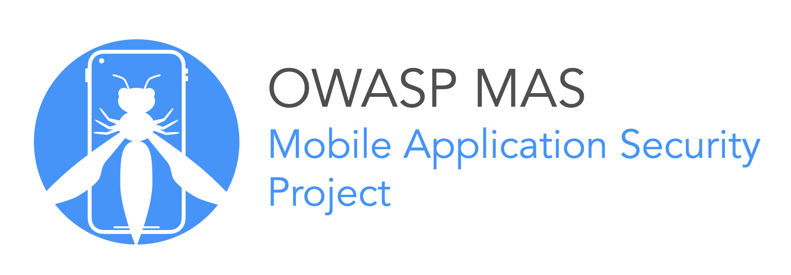
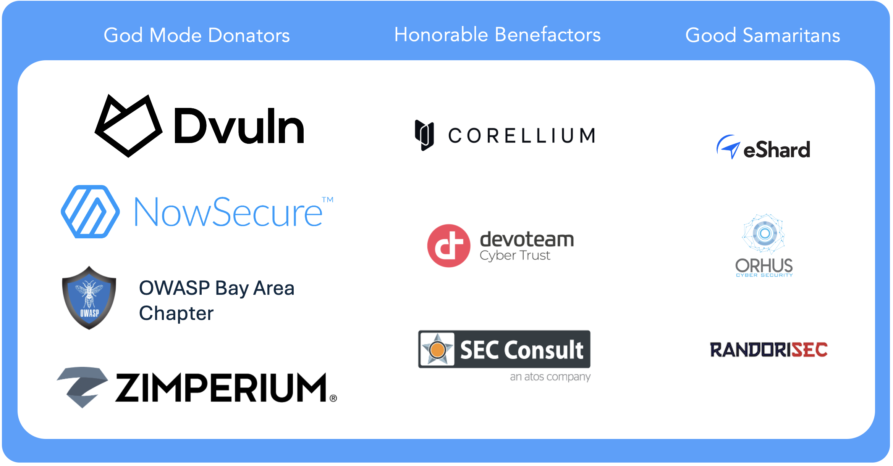

# 移动应用程序安全验证标准v2.10

## 前言

技术革命可以迅速发生，不到十年前，智能手机还是笨重的设备，键盘很小，对于精通技术的商业用户来说是昂贵的玩具。今天，智能手机已成为我们生活不可或缺的一部分。我们已经开始依赖它们来获取信息、导航和通信，它们在商业和社交生活中无处不在。

每一项新技术都会带来新的安全风险，而跟上这些变化是安全行业面临的主要挑战之一。防守方总是落后几步。例如，许多人的条件反射是传统思维观念：智能手机就像小型计算机，移动应用程序就像经典桌面软件一样，那么安全要求是相似的吗？但事实并非如此。智能手机操作系统不同于桌面操作系统，移动应用程序不同于Web应用程序。例如，基于签名的病毒扫描的经典方法在现代移动操作系统环境中没有意义：它不仅与移动应用程序分发模型不兼容，而且由于沙盒限制，它在技术上也是不可能的。此外，某些漏洞类型（如缓冲区溢出和XSS）在普通移动应用程序的上下文中的相关性不如在桌面和Web应用程序（例外情况适用）。

随着时间的推移，我们的行业已经更好地掌控了移动威胁形势。事实证明，移动安全就是数据保护：应用程序存储我们的个人信息、图片、录音、笔记、帐户数据、业务信息、位置等等。移动应用不仅是我们日常使用的服务，也是我们与他人沟通的桥梁。智能手机的内容一旦泄露，你就可以未经同意了解手机使用者的生活。当我们考虑到移动设备更容易丢失或被盗并且移动恶意软件不断增加时，对数据保护的需求就变得更加明显。

因此，移动应用的安全标准必须关注移动应用如何处理、存储和保护敏感信息。尽管iOS和Android等现代移动操作系统提供了用于安全数据存储和通信的成熟API，但应用开发者必须正确实施和使用这些API，操作系统提供的安全机制才能行之有效。数据存储、IPC通信、正确使用加密API和网络安全通信只是需要仔细考虑的一方面。

一个需要行业考虑的重要问题是，在保护数据的机密性和完整性方面究竟应该走多远。例如，我们大多数人都同意移动应用程序应该在TLS交换中验证服务器证书。但是证书或公钥固定呢？不这样做会导致漏洞吗？如果应用程序处理敏感数据，这应该是一项要求，还是可能适得其反？我们是否需要加密存储在SQLite数据库中的数据，即使操作系统对应用程序进行了沙盒处理？适合一个应用的东西可能不适合另一个应用。**OWASP MASVS（Mobile Application Security Verification Standard）**  尝试使用适合不同威胁场景的配置文件来标准化这些要求。

此外，root恶意软件和远程管理工具的出现使人们意识到移动操作系统本身存在可利用的缺陷，因此越来越多地使用容器化策略来为敏感数据提供额外的保护并防止客户端篡改。这就是事情变得复杂的地方。硬件支持的安全功能和操作系统级容器化解决方案（如Android Enterprise和Samsung Knox）确实存在，但它们在不同的设备上表现并不一致。作为安全的解决方案，可以实施基于软件的保护措施，但不幸的是，没有标准或测试流程来验证这些类型的保护措施。

因此，移动应用安全测试报告无处不在：例如，一些测试人员将Android应用中缺乏混淆或root检测报告为“安全漏洞”。另一方面，字符串加密、调试器检测或控制流混淆等措施不被视为强制性的。然而，这种看待事物的二元方式是没有意义的，因为弹性（韧性）不是一个二元命题，即非黑即白的问题：它取决于人们旨在防御的特定客户端面临怎样的威胁。软件保护并非没有意义，但它们最终可以被绕过，因此绝不能被用作安全控制的替代品。

MASVS的总体目标是为移动应用程序安全提供基线，同时还允许包含针对客户端威胁的纵深防御措施和保护。MASVS旨在实现以下目标：

- 为寻求开发安全移动应用程序的软件架构师和开发人员提供要求
- 提供可在移动应用安全审查中进行测试的行业标准
- 明确软件保护机制在移动安全中的作用，并提出验证其有效性的要求
- 就不同用例推荐的安全级别提供具体建议

我们深知100%行业共识是不可能实现的。尽管如此，我们希望MASVS有助于在移动应用程序开发和测试的所有阶段提供指导。作为一个开源标准，MASVS将随着时间的推移而发展，我们欢迎任何贡献和建议。

    -- Bernhard Mueller

## 关于标准

**OWASP 移动应用程序安全验证标准 （MASVS）** 是移动应用程序安全的行业标准。它提供了一套全面的安全控制措施，可用于评估跨各种平台（例如Android、iOS）和部署场景（例如消费者、企业）的移动应用程序的安全性。该标准涵盖了移动应用攻击面的关键组件，包括存储、加密、身份验证和授权、网络通信、与移动平台的交互、代码质量以及防止逆向工程和篡改的韧性。

OWASP MASVS是社区多年努力和行业共同反馈的结果。我们感谢所有帮助制定此标准的贡献者。我们欢迎您随时对OWASP MASVS提供反馈，尤其是当您将其应用于自己的组织和移动应用程序开发项目时。从各种移动应用程序开发人员那里获得意见将有助于我们改进和更新标准，该标准会根据您的意见和反馈定期修订。

您可以在OWASP MASVS存储库 https://github.com/OWASP/owasp-masvs/discussions 中使用GitHub Discussions提供反馈，或直接通过官方联系方式 https://mas.owasp.org/contact/ 联系项目负责人。OWASP MASVS 和 MASTG（OWASP移动应用安全测试指南）受到以下平台提供商以及标准化组织、政府和教育机构的信任。[了解更多信息请点击此处](https://mas.owasp.org/MASTG/Intro/0x02b-MASVS-MASTG-Adoption/)。

### 作者

**Sven Schleier**

Sven专门从事渗透测试和应用程序安全工作，并指导许多从项目初始就开始考虑安全性的移动应用项目。他坚信知识共享，并在世界各地的聚会和会议上发表演讲，是一名兼职教授，并正在为渗透测试人员、开发人员和学生举办有关移动应用安全的实践研讨会。

**Carlos Holguera**

Carlos是一名移动安全研究工程师，在移动应用和嵌入式系统（如车载控制单元和IoT设备）的安全测试方面拥有多年的实践经验。他热衷于移动应用程序的逆向工程和动态检测，并不断学习和分享他的知识。

**Jeroen Beckers**

Jeroen是一名移动安全主管，负责保证移动安全项目的质量和所有移动项目的研发。自从他的硕士论文开始研究Android安全以来，Jeroen就一直开始关注移动设备及其安全性。他喜欢与他人分享他的知识，他在学院、大学、客户和会议上的许多演讲和培训都证明了这一点。

**Bernhard Mueller**

Bernhard是一位网络安全专家，具有入侵各种系统的黑客天赋。深耕安全行业十多年，他发布了许多针零日漏洞。BlackHat USA表彰了他在移动安全方面的开创性工作，并获得了Pwnie最佳研究奖。

**Jeroen Willemsen**

Jeroen是一位首席安全架构师，对移动安全和风险管理充满热情。他曾以安全教练、安全工程师和全栈开发人员的身份为公司提供支持。他喜欢解释技术主题：从安全问题到编程挑战。

### 贡献者

我们所有的贡献者都列在[OWASP MAS官方网站](https://mas.owasp.org/contributing/)。

### 捐赠

虽然**MASVS**和**MASTG（移动应用安全测试指南）**都是由社区在自愿的基础上创建和维护的，但有时需要外部帮助。因此，我们感谢我们的捐助者提供资金，以便能够聘请技术编辑。请注意，他们的捐赠不会以任何方式影响MASVS或MASTG的内容。捐赠同样在[OWASP MAS官方网站](https://mas.owasp.org/donate/packages/)上有描述。

### 更改日志

我们所有的更新日志都可以在OWASP MASVS GitHub存储库中在线获得，请参阅[发布页面](https://github.com/OWASP/owasp-masvs/releases)。

### 版权许可

版权所有©The OWASP Foundation。本作品已获得许可，License **CC BY-SA 4.0**。对于任何重复使用或分发，您必须向他人明确本作品的许可条款。

## 移动应用安全验证标准

移动应用程序安全验证标准（Mobile Application Security Verification Standard, MASVS）是由**开放式Web应用程序安全项目（Open Worldwide Application Security Project, OWASP）**制定的综合安全标准。该框架提供了一套清晰简洁的准则和最佳实践，用于评估和增强移动应用程序的安全性。MASVS旨在用于移动应用安全验证的指标、指南和基线，为开发人员、应用程序所有者和安全专业人员提供宝贵的借鉴。

MASVS的目标是通过提供一组解决最常见的移动应用程序安全问题的控制措施，建立对移动应用程序安全性的高度信心。这些控制措施的开发重点是在移动应用程序整个生命周期内提供指导，并用作采购期间移动应用程序安全验证的基线。

通过遵守OWASP MASVS中概述的控制措施，组织可以确保其移动应用程序在构建时就考虑到安全性，从而降低安全漏洞带来的风险并保护用户敏感数据。无论用作标准、指导还是基线，OWASP MASVS都是无价之宝，可以增强移动应用程序的安全性。

OWASP MASVS是一份动态文档，并定期更新以反映不断变化的威胁形势和新的攻击媒介。因此，了解[最新版本的标准](https://mas.owasp.org/MASVS/)并相应地调整安全措施非常重要。

### 移动应用程序安全模型

该标准分为不同的组，代表移动攻击面的最关键区域。这些标记为 MASVS-XXXXX 的对照组为以下领域提供指导和标准：

- MASVS-STORAGE：设备上敏感数据的安全存储（静态数据）
- MASVS-CRYPTO：用于保护敏感数据的加密功能
- MASVS-AUTH：移动应用程序使用的身份验证和授权机制
- MASVS-NETWORK：移动应用程序与远程端点（传输中的数据）之间的网络安全通信
- MASVS-PLATFORM：与底层移动平台和其他已安装应用程序的安全交互
- MASVS-CODE：数据处理和保持应用程序最新的安全最佳实践
- MASVS-RESILIENCE：对逆向工程和尝试篡改应用程序的**韧性（弹性）**
- MASVS-PRIVACY：隐私保护

每个控制组都包含标记为 MASVS-XXXXX-Y 的单独控制，它们为满足标准所需实施的特定安全措施提供了具体指导。

### MAS测试配置

MAS项目传统上提供三个验证级别（L1、L2 和 R），在2023年MASVS重构期间，社区重新审视了这些级别，并已重新设计为“[MAS 测试配置文件](https://docs.google.com/document/d/1paz7dxKXHzAC9MN7Mnln1JiZwBNyg7Gs364AJ6KudEs/edit#heading=h.hczhcez4uchd)”并移至“OWASP MASTG”。这些配置文件现在 [NIST OSCAL（Open Security Controls Assess ment Language，开放安全控制评估语言](https://pages.nist.gov/OSCAL/)）标准保持一致，该标准是可用于保护信息系统的安全控制的综合目录。

通过与OSCAL保持一致，MASVS为安全测试提供了一种更灵活、更全面的方法。OSCAL为安全控制信息提供了一个标准格式，允许在不同的系统和组织之间更容易地共享和重用安全控制。这允许更有效地使用资源，并为移动应用程序安全测试提供更有针对性的方法。

### 使用前提

使用MASVS时，请务必牢记以下前提：

- MASVS不能替代遵循安全开发最佳实践，例如安全编码或安全SDLC。在开发过程中应全面遵循这些做法，MASVS专门针对移动应用程序对其进行了补充
- MASVS假定您已针对应用生态系统的所有元素（例如后端服务器、IoT和其他配套设备）遵循了您所在行业和国家/地区的相关标准
- MASVS旨在评估移动应用程序的安全性，这些应用程序可以通过获取应用程序包进行静态分析，也可以通过在可能受到感染的设备上运行进行动态分析，并且还考虑任何基于网络的攻击，例如中间人攻击（MITM）

虽然OWASP MASVS是增强移动应用程序安全性的宝贵工具，但它不能保证绝对安全。它应用作安全要求的基线，但还应酌情实施其他安全措施，以解决移动应用的特定风险和威胁。

#### 移动应用的安全架构、设计和威胁建模

> OWASP MASVS假定遵循安全架构、设计和威胁建模的最佳实践作为基础。

从最初的规划、到设计阶段，再到部署和持续维护，安全必须成为移动应用程序开发所有阶段的首要任务。开发人员需要遵循安全开发最佳实践，确保安全措施优先保护敏感数据，并遵守政策法规，识别和解决可能成为攻击者目标的安全问题。

虽然MASVS和MASTG重点关注应用程序安全评估的控制和技术测试用例，但非技术方面，例如遵循**OWASP软件保障成熟度模型**（OWASP Software Assurance Maturity Model, [SAMM](https://owaspsamm.org/model/)）或 **NIST.SP.800-218 安全软件开发框架**规定的最佳实践 （NIST.SP.800-218 Secure Software Development Framework，[SSDF](https://nvlpubs.nist.gov/nistpubs/SpecialPublications/NIST.SP.800-218.pdf)）对于安全架构、设计和威胁建模仍然很重要。 MASVS还可以用作威胁模型的参考和输入，以提高对潜在攻击的认识。

为了确保遵循这些实践，开发人员可以提供遵守这些标准的文档或证据，例如设计文档、威胁模型和安全架构图。此外，还可以进行访谈来收集有关遵守这些做法的信息，并了解对这些标准的遵守程度。

#### 安全应用的生态系统

> OWASP MASVS假设还利用其他相关安全标准来确保参与应用程序操作的所有系统都满足其适用要求。

移动应用程序经常与多个系统交互，包括后端服务器、第三方API、蓝牙设备、汽车、物联网设备等。这些系统中的每一个都可能引入自己的安全风险，必须将其视为移动应用程序安全设计和威胁建模的一部分。例如，与后端服务器交互时，应该使用 **OWASP 应用程序安全验证标准**（OWASP Application Security Verification Standard，[ASVS](https://owasp.org/www-project-application-security-verification-standard/)）来确保满足所需的安全标准。对于蓝牙设备，应用程序应设计为防止未经授权的访问，而对于汽车，应用程序应设计为保护用户的数据并确保汽车行驶中不存在安全问题。

#### 安全知识和专业技能

> OWASP MASVS假定使用该标准的开发人员和安全专业人员具有一定水平的安全知识和专业知识。了解移动应用安全概念以及用于移动应用安全测试和评估的相关工具和技术非常重要。为了支持这一点，OWASP MAS项目还提供了 **OWASP移动应用程序安全测试指南[MASTG](https://mas.owasp.org/MASTG/)**，该指南提供了有关移动应用程序安全测试的深入指导。

移动应用程序开发是一个快速发展的领域，新技术、编程语言和框架不断涌现。对于开发人员和安全专业人员来说，跟上这些发展的最新趋势，并在基本安全原则方面打下坚实的基础至关重要。

OWASP SAMM提供专门的“[教育和指导](https://owaspsamm.org/model/governance/education-and-guidance/)”领域，旨在确保参与软件开发生命周期的所有利益相关者都能意识到软件安全风险，并具备减轻这些风险的知识和技能。这包括开发人员、测试人员、架构师、项目经理、高管和其他参与软件开发部署的人员。

### MASVS适用领域

通过遵守MASVS，无论使用何种开发方法，企业和开发人员都可以确保其移动应用程序的安全性并满足行业的安全标准。MASVS最常见的适用领域就是通过应用商店下载的应用，但 MAS资源和指南也适用于其他业务领域，例如预安装的应用程序和SDK。

#### 原生应用

原生应用程序是用特定于平台的语言编写的，例如适用于Android的`Java/Kotlin`或适用于iOS的`Objective-C/Swift`。

#### 跨平台和混合应用

基于跨平台（Flutter、React Native、Xamarin、Ionic 等）和混合（Cordova、PhoneGap、Framework7、Onsen UI 等）框架的应用程序可能容易受到原生应用中不存在的特定于平台的漏洞影响。例如，某些JavaScript框架可能会引入其他编程语言中不存在的新安全问题。因此，必须遵循所用框架的安全最佳实践。

MASVS与正在开发的移动应用程序类型无关。这意味着MASVS中概述的指南和最佳实践可以应用于所有类型的移动应用程序，包括跨平台和混合应用程序。

#### 预装应用

预装应用是指在出厂时安装在用户设备上的应用，并且可能具有较高的权限，使用户容易受到供应商强制商业行为的影响，例如广告推送。鉴于普通用户设备上预装了大量应用程序，因此以可量化的方式衡量其风险非常重要。

设备上可能会提供数百个预装应用，因此，自动化测试显得格外重要，而MAS标准子集潜在支持自动化测试工具。

#### SDK

SDK在移动应用价值链中发挥着至关重要的作用，为开发人员提供更快、更智能、更有利可图的构建所需的代码。开发人员严重依赖它们，每个移动应用程序平均使用30个SDK，90%的代码来自第三方。虽然SDK提供了大量的代码复用能力，节省开发时间，但它也带来了新的安全问题。

SDK提供了多种功能，应被视为一个单独的项目。应该将MASV应用于所使用的SDK，以尽可能高安全测试覆盖率。

## 评估和认证

### OWASP对待MASVS认证的立场

OWASP作为一个中立于供应商的非营利组织，不对任何供应商和软件提供官方认证。

所有涉及声明得到OWASP的认证和标记，均未经过OWASP的正式审查、注册或承认，因此依赖此类认证的组织需要谨慎对待对任何第三方或声称得到（M）ASVS 认证。

因此，任何组织不需要获取OWASP官方认证。

### 移动应用程序认证指南

验证移动应用程序是否符合MASVS的推荐方法是执行“开卷”审查，这意味着测试人员有权访问关键资源，例如应用程序的架构师和开发人员、项目文档、源代码和对端点的身份验证访问，包括对每个角色中的至少一个用户帐户的访问。

需要注意的是，MASVS仅涵盖移动应用程序（客户端）的安全性。它不包含与应用程序相关的远程端点（例如Web服务）的特定控制，针对其他服务，应根据适当的标准（例如 [OWASP 应用程序安全验证标准 ASVS ](https://owasp.org/www-project-application-security-verification-standard/)）对其进行验证。

认证组织必须在报告中保留验证范围（特别是当关键组件超出范围时）、验证结果摘要（包括通过和未通过的测试），并明确说明如何解决未通过的测试。保留详细的工作文件、屏幕截图或录音、可以复现问题的脚本（俗称PoC）以及测试过程记录（例如拦截代理日志和相关注释）被认为是标准的行业惯例。仅仅运行工具并报告故障是不够的；这并不能提供足够的证据证明所有关于认证级别的问题都经过了充分测试。如有争议，应有足够的支持性证据来证明每个经过验证的控制确实都经过了测试。

#### 使用OWASP移动应用程序安全测试指南（MASTG）

OWASP [MASTG](https://mas.owasp.org/MASTG/)是一本用于测试移动应用程序安全性的手册。它描述了验证MASVS中列出的控制措施的技术过程。MASTG包含一个测试用例列表，每个测试用例都与MASVS中的控制措施相对应。虽然MASVS控制措施是高级且通用的，但MASTG在每个移动操作系统的基础上提供深入的建议和测试过程。

MASTG不涵盖测试应用的远程端点。例如：

- **远程端点**：[OWASP Web 安全测试指南 (WSTG) ](https://owasp.org/www-project-web-security-testing-guide/)是一本综合指南，具有详细的技术说明和指导，用于全面测试Web应用程序和Web服务的安全性，并且可以与其他相关资源一起使用，以补充移动应用程序安全测试练习。
- **物联网 (IoT)**：[OWASP 物联网安全测试指南 (ISTG) ](https://owasp.org/owasp-istg/)为IoT领域的渗透测试提供了全面的方法，可灵活适应IoT市场的创新和发展，同时仍确保测试结果的可比性。该指南通过建立通用术语，帮助加强IoT设备制造商、运营商以及渗透测试团队之间的沟通。

#### 自动化安全测试工具的作用

鼓励使用代码扫描和黑盒测试工具，提高测试效率。然而，由于每个移动应用程序各不相同，仅使用自动化工具无法完成MASVS验证。为了全面验证应用程序的安全性，必须了解其使用的整体架构、业务逻辑、特定技术存在的安全隐患以及用到的框架。

### 其他用途

#### 作为详细的安全架构指南

移动应用安全验证标准的一个更常见用途是作为安全架构师的资源。两个主要的安全框架，SABSA 或 TOGAF，缺少完成移动应用程序安全架构审查所需的大量信息。MASVS可用于填补这些空白，允许安全架构师针对移动应用常见问题选择更好的控制措施。

#### 作为现成安全编码清单的替代品

许多组织都可以从MASVS中受益，可以根据特定领域应用程序的风险级别，有针对性的修改MASVS。只要每次修改得到维护，我们鼓励这种类型的fork，这样随着标准的发展如果应用程序通过了控制 4.1，也自然而然通过了fork的副本。

#### 作为安全测试方法的基础

良好的移动应用安全测试方法应该涵盖MASVS中列出的所有控制。OWASP移动应用程序安全测试指南 （MASTG） 描述了每个验证控制措施的黑盒和白盒测试用例。

#### 作为自动化单元和集成测试的指南

MASVS的设计目标是高度可测试，但架构控制除外。基于MASVS控制的自动化单元测试、集成和验收测试可以集成到整个开发生命周期中。这不仅可以提高开发人员的安全意识，还可以提高最终应用程序的整体质量，并减少预发布阶段安全测试发现的问题数量。

#### 用于安全开发培训

MASVS还可用于定义安全移动应用程序的特征。许多“安全编码”课程只是道德黑客课程，只有少量的编码技巧。这对开发人员没有帮助。相反，安全开发课程可以使用MASVS，重点关注 MASVS中记录的主动控制，而不是仅仅关注诸如十大安全编码问题。

## MASVS-STORAGE: 存储

移动应用会处理各种敏感数据，例如个人身份信息PII、加密材料、机密信息和API密钥，这些数据通常需要存储在本地。这些敏感数据可能存储在私密位置，例如应用的内部存储空间，也可能存储在用户或设备上安装的其他应用可访问的公共文件夹中。敏感数据也可能被无意存储或暴露在可公开访问的位置，这通常是由于开放人员无意识的使用某些API或系统功能（例如备份或日志）。

此类别旨在帮助开发人员确保应用程序有意存储的任何敏感数据都得到妥善保护，无论数据存储位置在哪。它还涵盖由于不当使用API或系统功能而可能发生的意外数据泄漏。

| ID              | 控制             | 描述                                                         |
| --------------- | ---------------- | ------------------------------------------------------------ |
| MASVS-STORAGE-1 | 安全存储敏感数据 | 应用程序处理来自许多来源（例如用户、后端、系统服务或设备上的其他应用程序）的敏感数据，通常需要将其存储在本地。存储位置可能是应用程序私有目录，也可能是公开目录。此控制可确保应用程序有意存储的任何敏感数据都得到妥善保护，无论目标位置如何。 |
| MASVS-STORAGE-2 | 预防敏感数据泄露 | 在某些情况下，敏感数据会被无意中存储或暴露在公共目录；通常是由于使用某些API、系统功能（如备份或日志）造成的。此控制涵盖了这种无意数据泄漏，开发人员实际上有办法防止泄露发生。 |

## MASVS-CRYPTO: 密码学

加密技术对于移动应用至关重要，因为移动设备便携性极高，很容易丢失或被盗。这意味着，获得设备物理访问权限的攻击者可以访问存储在设备上的所有敏感数据，包括密码、财务信息和个人身份信息。加密技术通过加密来保护这些敏感数据，使未经授权的用户无法轻易读取或访问这些数据。

此类别中的控制措施旨在确保经过验证的应用根据行业最佳实践使用加密技术，这些最佳实践通常在外部标准中定义，例如[NIST.SP.800-175B](https://csrc.nist.gov/publications/detail/sp/800-175b/rev-1/final)和[NIST.SP.800-57](https://csrc.nist.gov/publications/detail/sp/800-57-part-1/rev-5/final)。此类别还侧重于加密密钥在其整个生命周期内的管理，包括密钥生成、存储和保护。密钥管理不善甚至会危及最强大的加密技术，因此开发人员必须遵循推荐的最佳实践，以确保用户敏感数据的安全。

| ID             | 控制                                         | 描述                                                         |
| -------------- | -------------------------------------------- | ------------------------------------------------------------ |
| MASVS-CRYPTO-1 | 采用当前的强加密技术，并根据行业最佳实践使用 | 加密技术在保护用户数据方面发挥着重要作用，在移动环境中尤其如此，因为攻击者很可能对用户设备进行物理访问。此控制涵盖了一般加密最佳实践，这些最佳实践通常在外部标准中定义。 |
| MASVS-CRYPTO-2 | 根据行业最佳实践管理密钥                     | 即使是最强大的加密技术也会因密钥管理不善而受到破坏。此控制涵盖加密密钥整个生命周期的管理，包括密钥生成、存储和保护。 |

## MASVS-AUTH: 身份验证和授权

身份验证和授权是大多数移动应用（尤其是连接到远程服务的应用）的基本组成部分。这些机制提供了额外的安全保障，有助于防止未经授权访问用户敏感数据。虽然这些机制必须在远程端点上执行，但同样重要的是，应用必须遵循相关的最佳实践，以确保安全使用所涉及的协议。

移动应用通常使用不同形式的身份验证（例如生物识别、PIN或多因素身份验证代码生成器）来验证用户身份。必须正确实施这些机制，以确保其有效防止未经授权的访问。此外，某些应用可能仅依赖本地客户端验证，而非远程服务器。在这种情况下，必须确保本地身份验证机制是安全的，并按照行业最佳实践实施。

此类别中的控件旨在确保应用程序安全地实现身份验证和授权机制，保护用户敏感信息并防止未经授权的访问。 重要的是要注意，还应使用行业标准（例如 [OWASP 应用程序安全验证标准 ASVS ](https://owasp.org/www-project-application-security-verification-standard/) ）验证远程端点的安全性。

| ID           | 控制                                               | 描述                                                         |
| ------------ | -------------------------------------------------- | ------------------------------------------------------------ |
| MASVS-AUTH-1 | 使用安全的身份验证和授权协议，并遵循相关的最佳实践 | 大多数连接到远程端点的应用都需要用户身份验证，并且还会强制执行某种授权。虽然这些机制必须在远程端点上执行，但应用还必须确保遵循所有相关的最佳实践，以确保安全使用相关协议。 |
| MASVS-AUTH-2 | 根据平台最佳实践完成本地身份验证                   | 许多应用允许用户通过生物识别或本地PIN码进行身份验证。需要正确实施这些身份验证方案。此外，某些应用可能没有远程端点，完全依赖本地应用身份验证。 |
| MASVS-AUTH-3 | 通过额外的身份验证来保护敏感操作                   | 对于应用内的敏感操作，通常需要某种额外的身份验证形式。这可以通过不同的方式实现（生物识别、密码、MFA 代码生成器、电子邮件、deeplink等），并且都需要安全地实施。 |

## MASVS-NETWORK: 网络通信

安全网络是移动应用安全的一个重要方面，特别是连网应用。为了确保传输数据的机密性和完整性，开发人员通常依赖于远程端点的加密和身份验证，例如通过使用TLS。然而，开发人员可能会通过多种方式意外禁用平台安全默认值、使用过时API或第三方库绕过安全协议。

此类别旨在确保移动应用在任何情况下都能建立安全连接。具体来说，它侧重于验证应用是否为网络通信建立了安全的加密通道。此外，此类别还涵盖开发人员可能选择仅信任特定证书颁发机构CA的情况，这通常称为**证书绑定（certificate pinning）**或公钥绑定（public key pinning）。

| ID              | 控制                                     | 描述                                                         |
| --------------- | ---------------------------------------- | ------------------------------------------------------------ |
| MASVS-NETWORK-1 | 根据当前最佳实践保护所有网络流量         | 对于连网通信的应用来说，确保传输中数据的机密性和完整性都至关重要。这通常是通过加密数据和验证远程端点来实现的，就像TLS一样。然而，开发人员可能会通过多种方式意外禁用平台安全默认值、使用过时API或第三方库绕过安全协议。这种控制可确保应用在任何情况下都能真正建立安全连接。 |
| MASVS-NETWORK-2 | 对开发人员控制下的所有服务器执行证书绑定 | 此控制不会信任框架或设备的默认根证书，而是确保只信任特定的CA。这种做法通常称为证书/公钥绑定。 |

## MASVS-PLATFORM: 平台交互

移动应用的安全性在很大程度上取决于它们与移动平台的交互，涉及平台提供的进程间通信 （IPC） 机制、 WebView，这些平台组件可能会为了增强用户体验而暴露数据。但是，攻击者或其他已安装的应用也可能利用这些机制，从而危及目标应用的安全性。

此外，敏感数据（如密码、信用卡详细信息和通知中的一次性密码）通常会显示在应用程序的用户界面中。必须确保这些数据不会通过平台机制（如自动生成的屏幕截图）无意泄露，例如通过自动生成的屏幕截图、网络或者设备共享泄露。

此类别包含确保应用与移动平台安全交互的控制措施。这些控制措施包括安全使用平台提供的IPC机制、WebView配置以防止敏感数据泄露和功能暴露，以及在应用的用户界面中安全显示敏感数据。通过实施这些控制措施，移动应用开发者可以保护用户敏感信息并防止攻击者未经授权访问。

| ID               | 控制                | 描述                                                         |
| ---------------- | ------------------- | ------------------------------------------------------------ |
| MASVS-PLATFORM-1 | 安全使用IPC通信机制 | 应用通常使用平台提供的IPC机制来传输数据。已安装的应用能够以许多不同的方式与目标应用程序进行交互。此控制可确保安全使用IPC。 |
| MASVS-PLATFORM-2 | 安全使用WebView     | WebView通常会被那些需要改善UI的应用使用。此控制可确保安全地配置WebView，以防止敏感数据泄露以及敏感功能泄露（例如，通过JavaScript桥接执行本地代码）。 |
| MASVS-PLATFORM-3 | 安全使用用户界面    | 在许多情况下，敏感数据必须显示在UI中（例如密码、信用卡详细信息、通知栏中的一次性密码）。此控制可确保这些数据不会因平台机制而无意泄露，例如通过自动生成的屏幕截图、网络或者设备共享泄露。 |

## MASVS-CODE: 代码质量

移动应用程序有许多数据入口点，包括UI、IPC、网络和文件系统，它们可能会接收被篡改的数据。通过将这些数据视为不受信任的输入并在使用前对其进行适当的验证和清理，开发人员可以防止经典的注入攻击，例如SQL注入、XSS或不安全的反序列化。但是，其他常见的编码漏洞（例如内存破坏）在渗透测试中难以直接被发现，但可以通过安全架构和编码实践轻松预防。开发人员应遵循最佳实践，例如**OWASP软件保障成熟度模型**（OWASP Software Assurance Maturity Model, [SAMM](https://owaspsamm.org/model/)）或 **NIST.SP.800-218 安全软件开发框架**规定的最佳实践 （NIST.SP.800-218 Secure Software Development Framework，[SSDF](https://nvlpubs.nist.gov/nistpubs/SpecialPublications/NIST.SP.800-218.pdf)），在最开始就避免引入这些缺陷。

此类别涵盖来自外部（例如应用数据入口点、操作系统和第三方组件）的编码漏洞。开发人员应验证和清理所有外部数据，以防止注入攻击和绕过安全检查。他们还应强制应用更新，并确保应用运行在最新的平台上，以使用户降低已知漏洞带来的安全风险。

| ID           | 控制                         | 描述                                                         |
| ------------ | ---------------------------- | ------------------------------------------------------------ |
| MASVS-CODE-1 | 最新的平台版本               | 移动操作系统的每个版本都包含安全补丁和新的安全功能。通过支持旧版本，应用程序仍然容易受到已知威胁的攻击。此控制可确保应用在最新的平台版本上运行，以便用户具有最新的安全保护措施。 |
| MASVS-CODE-2 | 强制应用更新                 | 即使应用发布，也有可能被发现新的严重漏洞。此控制可确保有一种机制来强制用户在继续使用应用之前更新应用。 |
| MASVS-CODE-3 | 使用没有已知漏洞的三方组件   | 为了真正安全，应该对所有应用组件执行完整的白盒评估。然而，对于第三方组件，通常不是安全评估的一部分。此控制涵盖一些发现漏洞的非常简单的方法，例如扫描开源组件已知CVE漏洞。 |
| MASVS-CODE-4 | 验证并检查所有不受信任的输入 | 应用有许多数据入口点，包括UI、IPC、网络、文件系统等。这些传入数据可能被不受信任的参与者无意中修改，从而绕过关键安全检查或者受到经典注入攻击（例如SQL注入、XSS或不安全的反序列化）。此控制可确保这些数据被视为不受信任的输入，并在使用前经过适当的验证和清理。 |

## MASVS-RESILIENCE: 对抗逆向工程和防止篡改的韧性

代码混淆、反调试、反篡改等纵深防御措施对于提高应用抵御逆向工程和特定客户端攻击的能力至关重要。它们为应用添加了多层安全控制，使攻击者更难以对应用程序进行逆向并从中提取有价值的知识产权或敏感数据。攻击者的逆向可能导致：

- 窃取或泄露宝贵的商业资产，如专有算法、商业机密或客户数据
- 因收入损失或法律诉讼而造成的重大财务损失
- 因违反合同或法规而造成的法律和声誉受损
- 因负面宣传或客户不满而损害品牌声誉

此类别中的控制措施旨在确保应用在受信任的平台上运行，防止在运行时被篡改，并确保应用预期功能的完整。此外，这些控制措施会阻碍攻击者对应用逻辑的理解，因为使用静态分析很难弄清楚应用的工作原理，并阻止可能允许攻击者在运行时修改代码的动态分析（称之为插桩或者hook）和检测。

但请注意，缺少任何这些措施并不一定会导致漏洞。相反，它们为应用程序增加了针对特定威胁的额外保护，这些应用程序还必须根据其特定的威胁模型满足OWASP MASVS安全控制的其余部分。

| ID                 | 控制           | 描述                                                         |
| ------------------ | -------------- | ------------------------------------------------------------ |
| MASVS-RESILIENCE-1 | 验证平台完整性 | 在被篡改的平台上运行对应用程序来说非常危险，因为这可能会禁用某些安全功能，使应用程序的数据面临风险。信任平台对于许多依赖平台安全性的MASVS控制至关重要（例如安全存储、生物识别、沙盒等）。此控制试图验证操作系统没有受到篡改（例如root），因此其功能是值得信赖的。 |
| MASVS-RESILIENCE-2 | 实现防篡改机制 | 应用程序在用户控制的设备上运行，如果没有适当的保护，很容易被二次打包后运行（例如在游戏中作弊或免费启用高级功能），或将带有后门的版本上传到第三方应用商店。此控制试图通过防止对原始代码和资源进行修改来确保应用程序预期功能的完整性。 |
| MASVS-RESILIENCE-3 | 对抗静态分析   | 了解应用程序的内部结构通常是篡改应用程序（无论是动态还是静态）的第一步。这种控制试图对抗静态分析，如反编译，以加大攻击者对应用程序工作原理的理解。 |
| MASVS-RESILIENCE-4 | 对抗动态分析   | 有时纯静态分析非常困难且耗时，因此它通常与动态分析齐头并进。在运行时观察和操作应用程序可以更轻松地破译其行为。此控制旨在使执行动态分析变得尽可能困难，并防止动态插桩，因为动态插桩可能允许攻击者在运行时修改代码。 |

## MASVS-PRIVACY: 隐私

MASVS-PRIVACY 的主要目标是为**用户隐私提供基线**。它并不旨在涵盖用户隐私的所有方面，尤其是当其他标准和法规（如ENISA或GDPR）已经做到这一点时。我们专注于应用程序本身，能够通过公开可用、静态或动态分析等方法在应用程序中找到的信息来测试隐私相关的内容。

虽然一些相关测试可以自动化，但由于隐私的微妙性，有些测试需要人工干预。例如，如果某个应用收集了应用商店或隐私政策中未提及的数据，则需要仔细的人工检查才能发现这一点。

> **关于“数据收集和共享”的说明**：对于MASTG测试，我们以统一的方式处理“收集”和“共享”。这意味着，无论应用是将数据发送到另一台服务器还是将数据传输到设备上的另一个应用，我们都将其视为可能脱离用户控制的数据。由于访问限制和服务器端操作的动态性质，验证云侧数据的情况具有挑战性，而且通常不可行。因此，这个问题超出了MASVS的范围。

**重要免责声明：**

MASVS-PRIVACY并非旨在作为详尽或排他性的参考。也就是说虽然MASVS-PRIVACY为应用的隐私关注点提供了有价值的指导，但它永远不能取代全面完整的隐私评估，例如《通用数据保护条例》（GDPR）或其他相关法律和监管框架规定的数据保护影响评估（DPIA）。强烈建议利益相关者采取更加全面的隐私评估方法，将MASVS-PRIVACY提供的建议与更广泛的评估相结合，以确保全面遵守数据保护规定。鉴于隐私法规的专业性和数据保护的复杂性，这些评估最好由隐私专家而不是安全专家进行。

| ID              | 控制                                 | 描述                                                         |
| --------------- | ------------------------------------ | ------------------------------------------------------------ |
| MASVS-PRIVACY-1 | 最大程度地减少对敏感数据和资源的访问 | 应用程序应仅请求访问其功能需要的数据，并且始终在用户知情同意的情况下进行。此控制可确保应用程序实施数据最小化并限制不必要的访问控制，从而减少数据泄露。 |
| MASVS-PRIVACY-2 | 阻止对用户身份的识别                 | 保护用户身份至关重要。此控制强调使用不可链接技术（如数据抽象、匿名化和假名化）来防止识别和跟踪用户。 |
| MASVS-PRIVACY-3 | 在数据收集和使用方面是透明的         | 用户有权知道他们的数据是如何被使用的。此控制可确保应用提供有关数据收集、存储和共享做法的明确信息，包括用户无法直接感知的任何行为，例如后台数据收集。应用还应遵守有关数据声明的平台准则。 |
| MASVS-PRIVACY-4 | 使用户可以控制自己的数据             | 用户应该能够控制自己的数据。这种控制权可确保应用为用户提供管理、删除和修改其自身数据的机制，并根据需要更改隐私设置（例如撤销同意）。此外，当应用需要的数据超过最初指定的数据量时，应重新征得用户同意并更新其隐私声明。 |

    原文：<a href="https://github.com/OWASP/owasp-masvs/releases/tag/v2.1.0">OWASP Mobile Application Security Verification Standard v2.1.0</a> 
    翻译：请提交issue帮助我们更好的改进 <a href="https://github.com/liyansong2018/cybertrans/issues">issue@liyansong2018</a>

